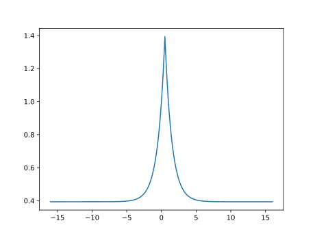
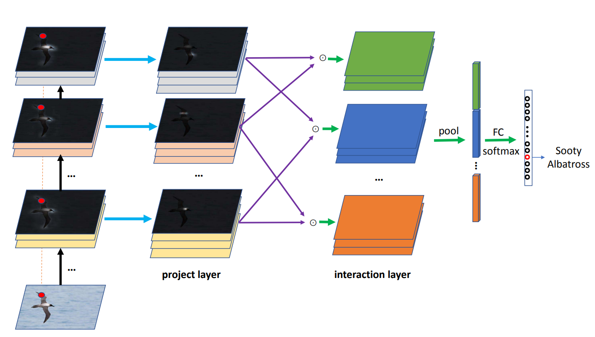

# 验收会发言

## 评价指标部分

### 常见评价指标

#### 均方差（Mean Square Error）

定义式如下：
$$
\begin{gathered}
\operatorname{loss}=\sum[y-(w x+b)]^{2} \\
L_{2}-\text { norm }=\|y-(w x+b)\|_{2} \\
\operatorname{loss}=\operatorname{norm}(y-(w x+b))^{2}
\end{gathered}
$$
均方差（Mean Square Error）这是最简单的评价指标之一，其中 $y$ 表示的是样本的真实值， $(wx +b)$ 表示的是神经网络的输出值，通过作差比较二者的差距即可得到我们想要的「真实结果和预测结果之间的误差」。

*Tips：*

- 均方差是最基础的损失函数之一
- 使用平方/范数的作用是消除在「梯度下降」的求导过程求解偏微分导致原变量导为1，所以要进行平方来提升参数的次数

#### 准确率、召回率、F-measure

从二分类入手，对于某二分类问题，我们可以通过 Label 集合与预测集合构建出*混淆矩阵*（Confusion Matrix）如下：

|                |      | True-Labels | True-Labels |
| -------------- | ---- | ----------- | ----------- |
|                |      | 1           | 0           |
| Predict-Labels | 1    | TP          | FP          |
| Predict-Labels | 0    | FN          | TN          |

通过上表，我们很显然的可以写出 Accuracy（准确度）函数的计算公式：
$$
Acc = \frac{TP + TN}{TP + FP + FN + TN}
$$
由上表可以定义*准确率*（Precision）函数：
$$
P = \frac{TP}{TP + FP}
$$
和*召回率*（Recall）函数：
$$
R = \frac{TP}{TP + FN}
$$
通过分析可知，Precision 描述的是 “预测为正确的可信度”；Recall 描述的是“查找正确的能力”。显然，只使用准确率或召回率其中的一个进行样本评估是不合理的，二者存在一定 track out 关系。为了均衡这一关系，可以使用 F-measure[[1] Yang Y . An Evaluation of Statistical Approaches to Text Categorization[J]. Proc Amia Annu Fall Symp, 1999, 1(1-2):358-362.]。其中 F1-score 的函数定义为：
$$
F_1=\frac{2 \times P \times R}{P+R}
$$

#### 宏平均（Macro-average）

二分类问题使用上述 F1-measure 并不会存在争议，但当我们在 n 个二分类问题上综合考察评价指标，上述方法失效。此时我们需要使用其他方法。在本文中我们使用了*宏平均*（Macro-average）和*加权平均*（Weight-Average）。

*宏平均*（Macro-average）是先对每一个分类求得统计指标，然后对所有指标求取算术平均值，最后对结果求 F1-score：

$$
\text {Macro}_{-} P=\frac{1}{n} \sum_{i=1}^{n} P_{i} \\
\text {Macro}_{-} R=\frac{1}{n} \sum_{i=1}^{n} R_{i} \\
\text {Macro}_{-} F=\frac{2\times \text {Macro}_{-} P \times \text {Macro}_{-} R}{\text {Macro}_{-} P + \text {Macro}_{-} R}
$$
#### 加权平均（Weight-average）

*加权平均*（Weight-Average）的目的是改善分类**数据集不平衡**的问题，其定义如下：
$$
Weight\_avg =\frac{1}{n} \sum^n_{i = 1} F_{1i} \times \theta_i
$$

其中 $F_{1i}$ 是第 $i$ 个分类的 F1-score，$\theta_i$ 是第 $i$ 个分类的样本占比。

#### 对比

相比于传统的 Accuracy 评价指标，宏平均和加权平均都更有优势。

- 宏平均权衡了分类问题中所有的类，并对他们进行调和，能够更好的反映分类任务的性能。
- 加权平均平衡了数据集各分类的占比，对本文所要解决的数据集严重不平衡任务尤其重要，是一个更加合理的评价指标。
- 传统 Accuracy 评价指标较差，尤其是当数据集不平衡时，Accuracy 将会收到更大的来自数据集的影响。

## 双线性池化部分

#### CNN中的特征融合

深度学习的迅速发展，让CNN成为了目前计算机视觉任务的头号选手。目前CNN已经称为各种计算机视觉识别任务的通用的特征提取方法。经过一段时间的发展后，可以发现简单的进行特征图融合是不利于细粒度分类问题的。其缺陷有如下两点：

- 导致训练参数的增大
- 卷积层相结合时无法正确捕捉层间特征关系

实际上，人们在此类问题上已经下足了功夫。比较典型的案例有：

- U-Net提出的加权交叉熵损失函数（Cross Entropy Loss with Weight）
  - 损失函数定义为：$E=\sum_{\mathbf{x} \in \Omega} w(\mathbf{x}) \log \left(p_{\ell(\mathbf{x})}(\mathbf{x})\right)$
    - 其中 $w(x)$ 计算，可大致理解为「如果某个地方难以识别，则加大力度去辨认这个地方」 
- *DiceLoss*（不展开介绍，由IoU评价指标发展而来）
- *VC-Net* 中的双重Loss的骚操作
  - 其中一个Loss（激活函数）的定义式：$F(x)=\alpha\left(e^{-|x-0.5|}-e^{-0.5}\right)+1$
  - 画出其图像：
    - 可以看到，这个函数在0.5处分界，当预测的概率约接近0.5，那么预测结果受到的惩罚就越大

为了解决上面的两个问题，相比直接从Loss或激活函数下手，还有一种途径是「直接处理特征向量」

#### 双线性池化（Bilinear-pooling）

*双线性池化*（Bilinear-pooling）主要用于特征融合，即对于**同一个样本的同一位置提取出来的不同特征** $A$ 和 $B$ ，通过双线性池化操作得到两个**特征融合后的向量**，进而将此向量用于分类。在*双线性池化*论文中，作者使用*双线性池化*对两种特征提取器提取到的特征进行融合，再用于 Fine-grained 分类，取得了不错的效果。与此同时，*双线性池化*的优点是形式简单、梯度计算简单、反向传播迅速。

计算过程如下：

对于图像 $\mathcal{I}$ 在位置 $l$ 的两个特征 $f_{A}(l, \mathcal{I}) \in \mathbb{R}^{T \times M}$ 和 $f_{B}(l, \mathcal{I}) \in \mathbb{R}^{T \times N}$, 进行如下操作:
$$
\begin{aligned}
b\left(l, \mathcal{I}, f_{A}, f_{B}\right) &=f_{A}^{T}(l, \mathcal{I}) f_{B}(l, \mathcal{I}) & & \in \mathbb{R}^{M \times N} \\
\xi(\mathcal{I}) &=\sum_{l} b\left(l, \mathcal{I}, f_{A}, f_{B}\right) & & \in \mathbb{R}^{M \times N} \\
x &=\operatorname{vec}(\xi(\mathcal{I})) & & \in \mathbb{R}^{M N \times 1} \\
z &= Q(x)
\end{aligned}
$$
其中 $vec()$ 是指进行向量化操作， $Q()$ 是指进行如二范数之类的运算。

上例是两个分类器的情况，对于细粒度图像分类，通过此类方法，可以使得使用一个向量来获取不同分类器之间的特征，这捕获了**特征通道之间成对的相关关系**，以此来提供比线性模型更强的特征表示。

#### 分层双线性池化（Hierarchical Bilinear Pooling）
HBP首先由华中科技大学提出于 ECCV2018，是针对双线性池化的一种改进。

在细粒度图像分类中，双线性池化(bilinear pooling)的模型已经被证明是有效的，然而，先前的大多方法忽略了这样一个事实：层间部分特征交互和细粒度特征学习是相互关联的并且可以相互加强。根据这一问题，作者提出一种新的模型结构。
- 提出了一种可跨层的双线性池化方法，用来捕获层间部分特征的关系
- 提出一种集成**多个跨层**双线性特征的分层双线性池化框架，增强模型的表达能力

HBP通过级联多个跨层的双线性池化模块来融合更多的卷积层特征。这相比传统的双线性池化有着如下优点：

- 增强了卷积层之间的特征融合
- 几乎没有增加训练参数
- 模型表达能力更强

#### Summary

上面的HBP的公式相对抽象，故在此进行详细举例说明：

##### 前提

​	假设有一个经典VGG-16网络，去掉VGG-16最后的全连接层，卷积层的最后三层定义为： $i_1, i_2, i_3,i$ 表示的是第几个VGG网络。那么我们假定整个神经网路系统中只有两个去掉全连接层的VGG-16网络，分别为 $A,B$，那么相应的卷积层定义为： $A_1, A_2, A_3$ 和 $B_1, B_2, B_3$ 。

- 定义双线性池化操作函数为 $BP(i_n, j_n)$ 
- 定义拼接向量的操作函数为 $Concate(i_n, j_n...)$ 

##### Case：双线性池化

$$
z = BP(A_3,B_3)
$$

然后把 $z$ 取代之前的全连接层直接丢到分类预测，得到结果。

#####  Case：分层双线性池化

$$
z_1 = BP(A_3, B_1) \\
z_2 = BP(A_3, B_2) \\
z_3 = BP(A_3, B_3) \\
z = Concate(z_1, z_2, z_3)
$$

然后把 $z$ 取代之前的全连接层直接丢到分类预测，得到结果。

第二种情况所得的效果SOTA了第一种传统双线性池化所得结果。

我的汇报完毕，谢谢大家的聆听！
