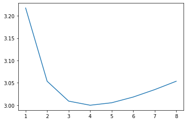
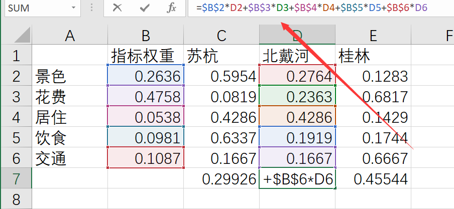
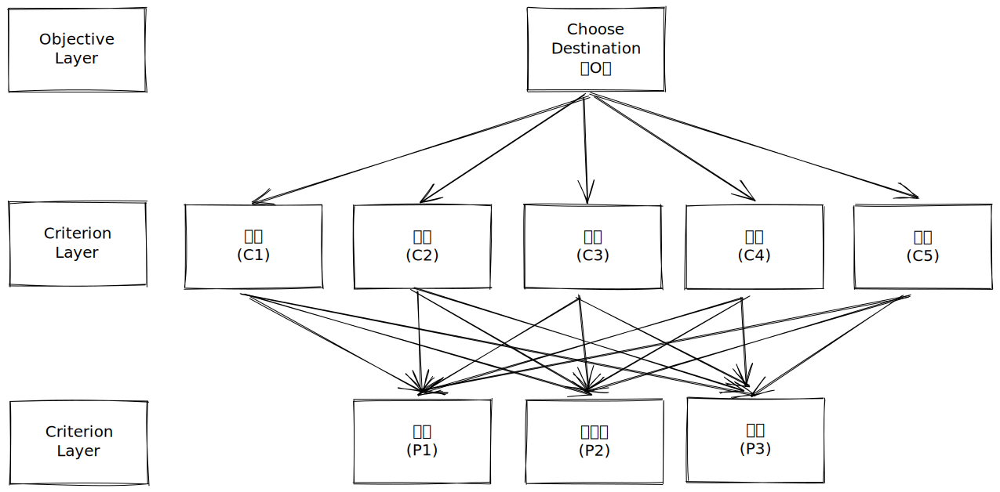
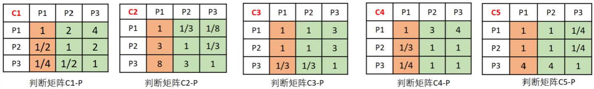
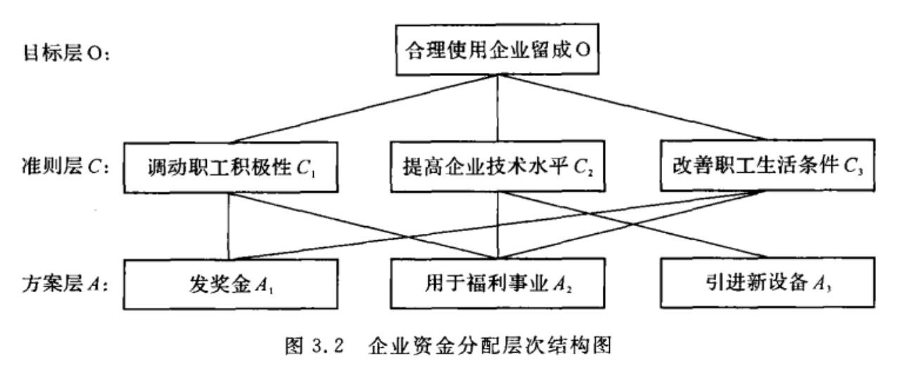
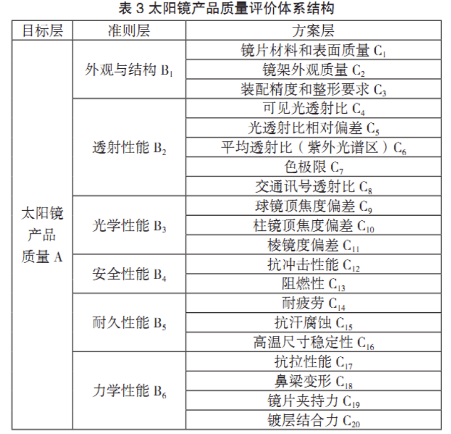

# 层次分析法

## 定义

- 简称：AHP（The analytic hierarchy process）
- 地位：建模比赛中最基础的模型之一
- 用途：解决**评价类问题**
- 举例：哪种方案最好、哪位运动员或者员工表现更加优秀

## 引例

### 题设

小明高考结束了，他的成绩可以上两所大学 A 和 B。那么应该选择哪一个呢？

### 思路

> 评价类问题可用打分解决

试想：如果是我们，那么应该怎样选择 A、B 两所大学呢？

很简单，无非就是对 A 和 B 评个分嘛

小明最关心大学里面的这四个方面（假设）：

| 方面     | 权重 |
| -------- | ---- |
| 学习氛围 | 0.4  |
| 就业前景 | 0.3  |
| 男女比例 | 0.2  |
| 校园景色 | 0.1  |

^ **注意：权重的和为 $1$** 

小明通过查找相关资料，对这两所大学的这四个方面有了一个大致的判断。那么小明接下来就要对这四个方面分别进行打分。

如何打分呢？**同一个方面的不同学校的分数加和为 $1$**

即学习氛围上，A 得到了 $0.6$ 分，那么 B 就是 $0.4$ 分。

通过上面的打分，我们可以列出如下表格：

|              | 指标权重 | 大学 A | 大学 B |
| ------------ | -------- | ------ | ------ |
| **学习氛围** | 0.4      | 0.7    | 0.3    |
| **就业前景** | 0.3      | 0.5    | 0.5    |
| **男女比例** | 0.2      | 0.3    | 0.4    |
| **校园景色** | 0.1      | 0.25   | 0.75   |

^ **注意：和为 $1$**

## 答题技巧

### 模板

我们根据*引例*的情况进行推广：

|            | 指标权重    | 分类 1     | 分类 2     | …           | 分类 N     |
| ---------- | ----------- | ---------- | ---------- | ----------- | ---------- |
| **方面 1** | $\alpha_1$  | $\beta_1$  | $\beta_2$  | $\beta...$  | $\beta_N$  |
| **方面 2** | $\alpha_2$  | $\gamma_1$ | $\gamma_2$ | $\gamma...$ | $\gamma_N$ |
| **…**      | $\alpha...$ | $\theta_1$ | $\theta_2$ | $\theta...$ | $\theta_N$ |
| **方面 M** | $\alpha_M$  | $\phi_1$   | $\phi_2$   | $\phi...$   | $\phi_N$   |

 则显然，上表所陈列的数据**必须符合如下公式**：
$$
\alpha_1 + \alpha_2 + \cdots + \alpha_M = 1 \\
\beta _1 + \beta _2 + \cdots + \beta _N = 1 \\
\gamma _1 + \gamma _2 + \cdots + \gamma _N = 1 \\
\theta _1 + \theta _2 + \cdots + \theta _N = 1 \\
\phi _1 + \phi _2 + \cdots + \phi _N = 1
$$

---

### 适用题设

- 请确定评价指标
- 请形成评价体系来确定xxx最xxx

符合以上两个要求的，这一类型的题目就叫做 **评价类问题**。

---

### 答题思路

1. 我们的评价目标是什么？
2. 我们为了达到这个目标有几种可以选择的方案？
3. 评价的准则（或者指标）是什么？（我们根据什么来评价优劣）

#### Tips

- 第三条是题目要求的，一定要认真提取题设信息
- 一般来说，前两个问题的答案是**显而易见**的，第三个问题的答案需要我们根据题目中所给出的**背景材料、生活常识以及网上搜集到的资料**进行结合，从而筛选出最为合适的指标

---

### 资料收集

原则：**使用论文搜索引擎收集相关资料**

搜索平台：知网、万方、百度学术、谷歌学术等平台

搜索技巧：直接搜 xxx + 选择 因素 方面 影响 等关键字

#### 寻找他人论文目的

1. **显得专业**
2. 别人的研究方法，思路技巧，实验数据均可以进行借鉴
3. 丰富自己论文的参考文献部分

#### 没有找到相关文献的处理方法

1. 和组内成员来一场紧张刺激的**头脑风暴**
2. 在搜索平台上直接进行搜索，获取别人或者专家的看法

#### 非论文搜索推荐

建议使用[「虫部落—快搜」](https://search.chongbuluo.com/)。这是一个搜索聚合平台，可以一件搜索多个平台的内容，方便我们查找相关资料

##### 优先级问题

1. 虫部落—快搜
2. 谷歌搜索
3. 微信搜索（相关公众号文章等）
4. 知乎搜索


---

## 引例2

### 题设

小明填好志愿之后打算出去旅游。他查阅了网络上的相关资料，初步选择了 *苏杭、北戴河和桂林* 这三个地方其中之一作为目标景点。

请你**确定评价指标、形成评价体系**来为小明同学选择最佳的方案。

### 思路

根据上面的「答题技巧—答题思路」，回答下列三个问题：

1. 我们的评价目标是什么？
   - 为小明同学选择最佳的旅游地点
2. 我们为了达到这个目标有几种可以选择的方案？
   - 三种。分别是去 *苏杭、北戴河和桂林*
3. 评价的准则（或者指标）是什么？（我们根据什么来评价优劣）
   - 题目没有明确给出相关的数据支撑，需要我们自行确定

### 资料

使用知网进行搜索「旅游 选择 因素」，很容易就可以得到相关研究文献。

### 解答

假设我们通过收集查阅资料后选择了以下的五个指标：

- 景点景色
- 旅游花费
- 居住环境
- 饮食情况
- 交通便利程度

现在不妨开开**脑洞**：加入小明现在就在我们面前，我们要对他提出哪些问题才能帮他合理做出决定？

那么最直接的答案就是：直接给他下面这张表，让他填上：

|          | 指标权重 | 苏杭 | 北戴河 | 桂林 |
| -------- | -------- | ---- | ------ | ---- |
| **景色** | 待填     | 待填 | 待填   | 待填 |
| **花费** | 待填     | 待填 | 待填   | 待填 |
| **居住** | 待填     | 待填 | 待填   | 待填 |
| **饮食** | 待填     | 待填 | 待填   | 待填 |
| **交通** | 待填     | 待填 | 待填   | 待填 |

但是这样做是有弊端的！

#### 直接问权重的弊端

上面直接问权重所得到的结果是片面的和不周全的

> 在确定影响某因素的诸因子在该因素中所占的比重时, 遇到的主要困难是这些比重常常不易定量化。此外, 当影响某因素的因子较多时,直接考虑各因子对该因素有多大程度的影响时, 常常会因考虑不周全、顾此失彼而使决策者提出与他实际认为的重要性程度不相一致的数据,甚至有可能提出一组隐含矛盾的数据。
>
> ——选自司守奎的《数学建模算法与应用教材》

比如，小明今天填的权重和明天填的可能是**不一样**的。

#### 分而治之的思想

分而治之，即分别治理，分开解决

使用分而治之的思想，我们的思路应为如下这样：

- 既然全部权重不好确定，那就先确定指标权重吧
- 一次性考虑 5 个指标权重之间的关系，往往不周到。那就进行两两比较，最终根据比较的结果来推算权重

## 层次分析法思想

#### 判断矩阵

假设有 $N$ 个指标，使用 $1-9$ 表示重要程度（见下表），那么请**两两比较**上述这 $N$ 个指标对于最终结果的重要性影响

|    标度    | 含义                                                        |
| :--------: | ----------------------------------------------------------- |
|     1      | 表示两个因素相比，具有**相同重要**性                        |
|     3      | 表示两个因素相比，一个因素比另一个因素**稍微重要**          |
|     5      | 表示两个因素相比，一个因素比另一个因素**明显重要**          |
|     7      | 表示两个因素相比，一个因素比另一个因素**强烈重要**          |
|     9      | 表示两个因素相比，一个因素比另一个因素**极端重要**          |
| 2, 4, 6, 8 | 上述两相邻判断的**中值**                                    |
|    倒数    | A 和 B 相比如果标度为 3，那么 B 和 A 相比就是 $\frac{1}{3}$ |

对于上面例题的 5 个指标，我们列出下表：

|          | 景色 | 花费 | 居住 | 饮食 | 交通 |
| :------: | :--: | :--: | :--: | :--: | :--: |
| **景色** |  1   |      |      |      |      |
| **花费** |      |  1   |      |      |      |
| **居住** |      |      |  1   |      |      |
| **饮食** |      |      |      |  1   |      |
| **交通** |      |      |      |      |  1   |

接下来对小明提出问题：

- Q：根据第一个表，请你比较**景色和花费**的重要程度
  - A：我认为花费比景色略微重要（介于同等重要 1 和稍微重要 3 之间，所以为 2）

|          | 景色  |     花费      | 居住 | 饮食 | 交通 |
| :------: | :---: | :-----------: | :--: | :--: | :--: |
| **景色** |   1   | $\frac{1}{2}$ |      |      |      |
| **花费** | **2** |       1       |      |      |      |
| **居住** |       |               |  1   |      |      |
| **饮食** |       |               |      |  1   |      |
| **交通** |       |               |      |      |  1   |

Q：根据第一个表，请你比较**景色和居住**的重要程度

- A：我认为景色比居住要重要一点（介于稍微重要 3 和明显重要 5 之间，所以为 4）

|          |     景色      |     花费      | 居住  | 饮食 | 交通 |
| :------: | :-----------: | :-----------: | :---: | :--: | :--: |
| **景色** |       1       | $\frac{1}{2}$ | **4** |      |      |
| **花费** |     **2**     |       1       |       |      |      |
| **居住** | $\frac{1}{4}$ |               |   1   |      |      |
| **饮食** |               |               |       |  1   |      |
| **交通** |               |               |       |      |  1   |

… …

就这样，小明一共需要回答 $C_5^2 = 10$ 次，我们根据他的回答填好了上面这张表：

|          |     景色      |     花费      | 居住  |     饮食      |     交通      |
| :------: | :-----------: | :-----------: | :---: | :-----------: | :-----------: |
| **景色** |       1       | $\frac{1}{2}$ | **4** |     **3**     |     **3**     |
| **花费** |     **2**     |       1       | **7** |     **5**     |     **5**     |
| **居住** | $\frac{1}{4}$ | $\frac{1}{7}$ |   1   | $\frac{1}{2}$ | $\frac{1}{3}$ |
| **饮食** | $\frac{1}{3}$ | $\frac{1}{5}$ | **2** |       1       |     **1**     |
| **交通** | $\frac{1}{3}$ | $\frac{1}{5}$ | **3** |     **1**     |       1       |

**Tips: **实际上，答题过程中没有小明帮我们去填写这张表，层次分析法中这张表是交给「专家」来填的，后面会讲

---

##### 小结

上面这张两张表均为方阵，我们记类似上表所构成的方阵为 $A$，对应的元素为 $a_{ij}$

这个方阵有如下特点：

1. $a_{ij}$ 表示的意义是，与指标 $j$ 相比，$i$ 的重要程度
2. 当 $i = j$ 时，两个指标相同，因此同等级记为 $1$，所以方阵 $A$ 的主对角线元素为 $1$
3. $a_{ij} > 0$ 且满足 $a_{ij} \times a_{ji} = 1$ （我们称满足这一条件的矩阵为 ***正互反矩阵*** ）

我们称上面这个方阵 $A$ 为层次分析法中的**判断矩阵**

---

同理，我们根据上面的过程如法炮制，继续填写我们所需要的后续 $5$ 张表：

|    景色    |     苏杭      |    北戴河     | 桂林 |
| :--------: | :-----------: | :-----------: | :--: |
|  **苏杭**  |       1       |       2       |  5   |
| **北戴河** | $\frac{1}{2}$ |       1       |  2   |
|  **桂林**  | $\frac{1}{5}$ | $\frac{1}{2}$ |  1   |

|    花费    | 苏杭 |    北戴河     |     桂林      |
| :--------: | :--: | :-----------: | :-----------: |
|  **苏杭**  |  1   | $\frac{1}{3}$ | $\frac{1}{8}$ |
| **北戴河** |  3   |       1       | $\frac{1}{3}$ |
|  **桂林**  |  8   |       3       |       1       |

|    居住    |     苏杭      |    北戴河     | 桂林 |
| :--------: | :-----------: | :-----------: | :--: |
|  **苏杭**  |       1       |       1       |  3   |
| **北戴河** |       1       |       1       |  3   |
|  **桂林**  | $\frac{1}{3}$ | $\frac{1}{3}$ |  1   |

|    饮食    |     苏杭      | 北戴河 | 桂林 |
| :--------: | :-----------: | :----: | :--: |
|  **苏杭**  |       1       |   3    |  4   |
| **北戴河** | $\frac{1}{3}$ |   1    |  1   |
|  **桂林**  | $\frac{1}{4}$ |   1    |  1   |

|    交通    | 苏杭 | 北戴河 |     桂林      |
| :--------: | :--: | :----: | :-----------: |
|  **苏杭**  |  1   |   1    | $\frac{1}{4}$ |
| **北戴河** |  1   |   1    | $\frac{1}{4}$ |
|  **桂林**  |  4   |   4    |       1       |

#### 判断矩阵的BUG

假设我们在填写的过程中形成了如下所示的判断矩阵：

|    景色    |     苏杭      |    北戴河     | 桂林  |
| :--------: | :-----------: | :-----------: | :---: |
|  **苏杭**  |       1       |       2       | **1** |
| **北戴河** | $\frac{1}{2}$ |       1       |   2   |
|  **桂林**  |     **1**     | $\frac{1}{2}$ |   1   |

不妨设 $苏杭 = A,北戴河 = B,桂林 = C$ ，由此判断矩阵将**逻辑转化为语言描述：**

- 苏杭比北戴河景色好一点
  - $A > B$
- 苏杭和桂林景色一样好
  - $A = C$
- 北戴河比桂林景色好一点
  - $B > C$

可以发现，上述不等式中**显然存在矛盾**

为了更好的阐述上述 BUG 的解决方法，在此引出**一致矩阵**

#### 一致矩阵

假设某一判断矩阵为 $\Sigma$ ，那么**一致矩阵**定义为：
$$
a_{ij} = \frac{i的重要程度}{j的重要程度},a_{jk} = \frac{j的重要程度}{k的重要程度} \\
a_{ik} = \frac{i的重要程度}{k的重要程度} = a_{ij}\times a_{jk}
$$

##### 一致矩阵的判定①

相关段落：[一致矩阵的判定②](#一致矩阵的判定②)

满足 $\forall (i,j,k) \in \Sigma,a_{ik} = a_{ij}\times a_{jk}$，那么就说这个判断矩阵是**一致矩阵**

##### 特点

观察下列两个一致矩阵：

|    景色    |     苏杭      |    北戴河     | 桂林 |
| :--------: | :-----------: | :-----------: | :--: |
|  **苏杭**  |       1       |       2       |  4   |
| **北戴河** | $\frac{1}{2}$ |       1       |  2   |
|  **桂林**  | $\frac{1}{4}$ | $\frac{1}{2}$ |  1   |

|          |     景色      |     花费      |     居住      |     饮食      |     交通      |
| :------: | :-----------: | :-----------: | :-----------: | :-----------: | :-----------: |
| **景色** |       1       | $\frac{1}{2}$ |       4       |       3       |       3       |
| **花费** |       2       |       1       |       8       |       6       |       6       |
| **居住** | $\frac{1}{4}$ | $\frac{1}{8}$ |       1       | $\frac{3}{4}$ | $\frac{3}{4}$ |
| **饮食** | $\frac{1}{3}$ | $\frac{1}{6}$ | $\frac{4}{3}$ |       1       |       1       |
| **交通** | $\frac{1}{3}$ | $\frac{1}{6}$ | $\frac{4}{3}$ |       1       |       1       |

我们可以发现**一致矩阵的特点：**

- 各行（各列）之间成倍数关系

---

Tips：**在使用判断矩阵求解权重之前，必须对其进行一致性检验**

为此，下面引出**一致性检验**的相关知识

#### 一致性检验

  ^ 本小结需要使用到线性代数，可直接忽略「证明过程」，只需要了解如何计算即可

##### 一致矩阵的判定②

相关段落：[一致矩阵的判定①](#一致矩阵的判定①)
$$
\begin{bmatrix}
a_{11} & a_{12}  & \cdots   & a_{1n}   \\
a_{21} & a_{22}  & \cdots   & a_{2n}  \\
\vdots & \vdots  & \ddots   & \vdots  \\
a_{n1} & a_{n2}  & \cdots\  & a_{nn}  \\
\end{bmatrix}
\text{为一致矩阵} \ \Leftrightarrow 

\left\{
\begin{aligned}
& a_{ij} > 0 \\
& a_{11} = a_{22} = \cdots=a_{nn} = 1 \\
& [a_{i1}, a_{i2},\cdots,a_{in}] = k_i[a_{11}, a_{12},\cdots,a_{1n}]
\end{aligned}
\right.
$$
**引理①：**

- $A$ 为 $n$ 阶方阵，且 $r(A) = 1$，则 $A$ 有一个特征值为 $tr(A)$，其余特征值均为 $0$
- 因为一致矩阵的各行成比例，所以一致矩阵的秩一定为 $1$

由引理可知：**一致矩阵由一个特征值为** $n$，其余特征值均为 $0$

另外，我们很容易得到，特征值为 $n$ 时，对应的特征向量刚好为 $k[\frac{1}{a_{11}}, \frac{1}{a_{12}},\cdots,\frac{1}{a_{1n}}]^T(k \neq 0)$

**引理②：**

- $n$ 阶正互反矩阵 $A$ 为一致矩阵 $\Leftrightarrow$ 最大特征值 $\lambda_{max} = n$
- 且当正互反矩阵 $A$ 非一致时，一定满足 $\lambda_{max} > n$

  ^ 上述引理证明比较复杂，具体请查阅相关数学建模教材

我们不妨将 $\lambda_{max}$ 进行可视化：

|    景色    |     苏杭      |    北戴河     | 桂林 |
| :--------: | :-----------: | :-----------: | :--: |
|  **苏杭**  |       1       |       2       |  a   |
| **北戴河** | $\frac{1}{2}$ |       1       |  2   |
|  **桂林**  | $\frac{1}{a}$ | $\frac{1}{2}$ |  1   |

当 $a$ 的数值变动时，画出 $\lambda_{max}$ 关于 $a$ 的函数图像如下：

```python
import numpy as np

import matplotlib.pyplot as plt
import numpy as np

def lambda_max(a):
    # 使用numpy计算矩阵特征值
    print(type(a))
    ret = np.array([])
    for i in a:
        A = np.array([[1, 2, i], [0.5, 1, 2], [1/i, 1/2, 1]])
        ret = np.append(ret, np.max(np.linalg.eig(A)[0]))  
    return ret

def plot_lambda():
    x = np.arange(1, 9, 1)
    y = lambda_max(x)
    plt.plot(x,y)
    plt.show()
plot_lambda()
```



显然，当 $a = 4$ 时，此矩阵是一个一致矩阵，由图像我们可以直观看出， $a = 4$ 时 $\lambda_{max}$ 取得最小值 $\lambda_{max} = n$，其中 $n$ 是方阵的阶数，此处为 $3$ 阶方阵

由此，我们可以看出：**「判断矩阵」与「此判断矩阵最接近的一致矩阵」越不一致时，最大特征值 $\lambda_{max}$ 与矩阵阶数 $n$ 的差距就越大**

##### 一致性检验的步骤

1. 计算**一致性标志** $CI$

   - $$
     CI = \frac{\lambda_{max} - n}{n - 1}
     $$

2. 查找对应的**平均随机一致性指标** $RI$

| $n$  | 1    | 2    |   3    | 4      | 5      | 6      | 7      | 8      | 9      | 10     | 11     | 12     | 13     | 14     | 15     |
| ---- | ---- | ---- | :----: | ------ | ------ | ------ | ------ | ------ | ------ | ------ | ------ | ------ | ------ | ------ | ------ |
| $RI$ | $0$  | $0$  | $0.52$ | $0.89$ | $1.12$ | $1.26$ | $1.36$ | $1.41$ | $1.46$ | $1.49$ | $1.52$ | $1.54$ | $1.56$ | $1.58$ | $1.59$ |

3. 计算**一致性比例** $CR$

   - $$
     CR = \frac{CI}{RI}
     $$

   - 如果 $CR < 0.1$，则可认为**判断矩阵的一致性可以接受**；否则需要**对判断矩阵进行修正**

###### 两个小问题

1. 平均随机一致性指标 $RI$ 怎么计算得到的？

   - $RI$ 的值，是通过随机方法构造 $500$ 个样本矩阵：随机地从 $[1, 9]$ 及其倒数中抽取数字构造正互反矩阵，球的最大特征根的平均值 $\lambda'_{max}$，并定义：
     $$
     RI = \frac{\lambda'_{max} - n}{n - 1}
     $$

2. 为什么要这样构造 $CI$，为什么要以 $0.1$ 作为划分依据？

   - 可以去查看原作者论文，作者是通过多次蒙特卡罗模拟得到的最佳的方案

#### 算数平均法求权重

##### 一致矩阵的计算

假设我们有一致矩阵如下：

|    景色    |     苏杭      |    北戴河     | 桂林 |
| :--------: | :-----------: | :-----------: | :--: |
|  **苏杭**  |       1       |       2       |  4   |
| **北戴河** | $\frac{1}{2}$ |       1       |  2   |
|  **桂林**  | $\frac{1}{4}$ | $\frac{1}{2}$ |  1   |

那么，直接读取上面这个**正互反矩阵的第一列**即可，也就是：

​	对于景色来说，苏杭的重要程度为 $1$，北戴河的重要程度为 $\frac{1}{2}$，桂林的重要程度为 $\frac{1}{4}$

**Tips：**

权重一定要进行归一化处理：
$$
\begin{aligned}
& 苏杭 & = \frac{1}{1 + \frac{1}{2} + \frac{1}{4}} \\
& 北戴河 & = \frac{\frac{1}{2}}{1 + \frac{1}{2} + \frac{1}{4}} \\
& 桂林 & = \frac{\frac{1}{4}}{1 + \frac{1}{2} + \frac{1}{4}}
\end{aligned}
$$

---

##### 普通判断矩阵的计算

假设我们有普通判断矩阵如下：

|    景色    |     苏杭      |    北戴河     | 桂林 |
| :--------: | :-----------: | :-----------: | :--: |
|  **苏杭**  |       1       |       2       |  5   |
| **北戴河** | $\frac{1}{2}$ |       1       |  2   |
|  **桂林**  | $\frac{1}{5}$ | $\frac{1}{2}$ |  1   |

**第一列：**
$$
\begin{aligned}
& 苏杭 & = \frac{1}{1 + \frac{1}{2} + \frac{1}{5}} \\
& 北戴河 & = \frac{\frac{1}{2}}{1 + \frac{1}{2} + \frac{1}{5}} \\
& 桂林 & = \frac{\frac{1}{5}}{1 + \frac{1}{2} + \frac{1}{5}}
\end{aligned}
$$
**第二列：**
$$
\begin{aligned}
& 苏杭 & = & \frac{2}{2 + 1 +\frac{1}{2}} \\
& 北戴河 & = & \frac{1}{2 + 1 +\frac{1}{2}} \\
& 桂林 & = & \frac{\frac{1}{2}}{2 + 1 +\frac{1}{2}}
\end{aligned}
$$
**第三列：**
$$
\begin{aligned}
& 苏杭 & = & \frac{5}{5 + 2 + 1} \\
& 北戴河 & = & \frac{2}{5 + 2 + 1} \\
& 桂林 & = & \frac{1}{5 + 2 + 1}
\end{aligned}
$$
之后对三列权重直接**求平均**即可

##### 总结

**Tips：**此两种写法均可以直接在论文中使用

###### 文字描述

1. 将判断矩阵按照列归一化处理（每一个元素➗所在列的和）

|    景色    |   苏杭   |   北戴河   |   桂林   |
| :--------: | :------: | :--------: | :------: |
|  **苏杭**  | $0.5822$ |  $0.5714$  | $0.625$  |
| **北戴河** | $0.2941$ | $ 0.2857 $ | $ 0.25 $ |
|  **桂林**  | $0.1177$ |  $0.1429$  | $0.125$  |

2. 将归一化的各列相加

|            |        未归一化的权重         |
| :--------: | :---------------------------: |
|  **苏杭**  | $0.5882+0.5714+0.625= 1.7846$ |
| **北戴河** |  $0.2941+0.2857+0.25=0.8298$  |
|  **桂林**  | $0.1177+0.1429+0.125=0.3856$  |

3. 将相加后得到的向量中每个元素除以 $n$ 即可得到最终权重向量

|            |            权重             |
| :--------: | :-------------------------: |
|  **苏杭**  | $\frac{1.7846}{3} = 0.5949$ |
| **北戴河** | $\frac{0.8298}{3} = 0.2766$ |
|  **桂林**  | $\frac{0.3856}{3} = 0.1285$ |

###### 数学描述

假设判断矩阵 $A$ 定义如下：
$$
A = 
\begin{bmatrix}
a_{11} & a_{12}  & \cdots   & a_{1n}   \\
a_{21} & a_{22}  & \cdots   & a_{2n}  \\
\vdots & \vdots  & \ddots   & \vdots  \\
a_{n1} & a_{n2}  & \cdots\  & a_{nn}  \\
\end{bmatrix}
$$
那么[算数平均法](#算数平均法求权重)求得的权重向量 $\omega_i$ 为：
$$
\omega_i = \frac{1}{n}\sum_{j = 1}^{n} \dfrac{a_{ij}}{ \sum\limits_{k = 1}^{n} a_{kj} }
,(i = 1,2,\cdots,n)
$$

#### 几何平均法求权重

同上，在此仅写总结部分

假设判断矩阵 $A$ 定义如下：
$$
A = 
\begin{bmatrix}
a_{11} & a_{12}  & \cdots   & a_{1n}   \\
a_{21} & a_{22}  & \cdots   & a_{2n}  \\
\vdots & \vdots  & \ddots   & \vdots  \\
a_{n1} & a_{n2}  & \cdots\  & a_{nn}  \\
\end{bmatrix}
$$

1. 将 $A$ 的元素**按照行相乘得到一个新的列向量**
2. 将新的列向量的每个分量**开 $n$ 次方**
3. 对该列向量进行归一化，得到最终权重向量

那么几何平均法求得的权重向量 $\omega _i$ 为：
$$
\omega_{i}=\frac{\left(\prod\limits_{j=1}^{n} a_{i j}\right)^{\frac{1}{n}}}{\sum\limits_{k=1}^{n}\left(\prod\limits_{j=1}^{n} a_{k j}\right)^{\frac{1}{n}}}, \quad(i=1,2, \cdots, n)
$$

#### 特征值法

一致矩阵有一个特征值为 $n$，其余特征值均为 $0$

由上面各种引理我们可以知道，特征值为 $n$​ 时，对应的特征向量刚好为
$$
k\left[\frac{1}{a_{11}}, \frac{1}{a_{12}}, \cdots, \frac{1}{a_{1 n}}\right]^{T}(k \neq 0)
$$
这一特征向量刚好为**一致矩阵的第一列**

但是，如果矩阵不是一致矩阵，应该怎么办呢？

> 如果判断矩阵的一致性可以接受，那么可以仿照一致矩阵权重的计算方法求解

1. 求出矩阵 $A$ 的最大特征值 $\lambda_{max}$ 以及其对应的特征向量
2. 对求出的**特征向量进行归一化**即可得到权重

#### 三种平均对比

对上述式子进行总结、整理我们可以得到如下表格：

|            | 算术平均法权重 | 几何平均法权重 | 特征值法权重 |
| :--------: | :------------: | :------------: | :----------: |
|  **苏杭**  |    $0.5949$    |    $0.5954$    |   $0.5954$   |
| **北戴河** |    $0.2766$    |    $0.2764$    |   $0.2764$   |
|  **桂林**  |    $0.1285$    |    $0.1283$    |   $0.1283$   |

 ^ 可以看到：三者区别特别小，几何平均和特征值法权重完全一致（可能是巧合，不必刨根问底）

##### 方法的选择

在实际比赛中，使用最多的是**「特征值法」**

> 比赛中，选用特征值法

### 数据处理

假设我们通过代码，算出最终的权重矩阵如下：

|      | 指标权重 | 苏杭    | 北戴河   | 桂林   |
| ---- | -------- | ------- | -------- | ------ |
| 景色 | 0.2636   | 0.5954  | 0.2764   | 0.1283 |
| 花费 | 0.4758   | 0.0819  | 0.2363   | 0.6817 |
| 居住 | 0.0538   | 0.4286  | 0.4286   | 0.1429 |
| 饮食 | 0.0981   | 0.6337  | 0.1919   | 0.1744 |
| 交通 | 0.1087   | 0.1667  | 0.1667   | 0.6667 |

那么，如何**计算最终分数**，来帮小明做决定呢？

计算很简单，例如苏杭得分为：
$$
\begin{aligned}
0.5954 \times 0.2636+0.0819 \times 0.4758+0.4286 \times 0.0538+0.6337 \times 0.0981+0.1667 \times 0.1087=0.299
\end{aligned}
$$
其余计算以此类推

我们除了使用代码计算之外，还可以考虑一个更加方便的方法：Excel

将数据导入到 Excel 中，在“苏杭”一栏下面键入：

```excel
=$B$2*C2+$B$3*C3+$B$4*C4+$B$5*C5+$B$6*C6
```

其中，`$B$2` 的意思是定义为常量，然后直接把单元格拉动即可得到我们想要的结果：



复制出来，得到如下表格：

|      | 指标权重 |  苏杭   |  北戴河  |  桂林   |
| :--: | :------: | :-----: | :------: | :-----: |
| 景色 |  0.2636  | 0.5954  |  0.2764  | 0.1283  |
| 花费 |  0.4758  | 0.0819  |  0.2363  | 0.6817  |
| 居住 |  0.0538  | 0.4286  |  0.4286  | 0.1429  |
| 饮食 |  0.0981  | 0.6337  |  0.1919  | 0.1744  |
| 交通 |  0.1087  | 0.1667  |  0.1667  | 0.6667  |
|      |          | 0.29926 | 0.245295 | 0.45544 |

## 应用步骤总结

### 第一步

分析系统中各因素之间的关系，建立系统的递阶**层次结构**，如：



 ^ 如果使用到了层次分析法，那么**论文中一定要有**这个层次结构图

#### 作图工具

- Visio
- 亿图
- 简单的可以直接使用 Powerpoint 内置的图像生成工具

### 第二步

#### 矩阵绘制

##### 数据填写问题

我们要构建判断矩阵，势必要对判断矩阵的数据进行填写操作

而理想情况下，专家填写的最具有权威性

但是我们打比赛肯定接触不到专家，所以这个数据只能通过其他论文搜集资料/凭借自己主管判断来进行填写

而上面这种方式是不具有很强的权威性的，不可以写在论文中，所以我们论文中直接给出我们填写后的判断矩阵即可，**无需说明数据的来源**

---

|  O   |  C1  |  C2  |  C3  |  C4  |  C5  |
| :--: | :--: | :--: | :--: | :--: | :--: |
|  C1  |  1   |      |      |      |      |
|  C2  |      |  1   |      |      |      |
|  C3  |      |      |  1   |      |      |
|  C4  |      |      |      |  1   |      |
|  C5  |      |      |      |      |  1   |

 ^ 上面这个矩阵的名称为**「判断矩阵 O-C」**

同理，有 O-C 矩阵，显然也得有 C-P 矩阵：



准则层——方案层的判断矩阵的数值要**结合实际情况**来填写，如果题目中有其他数据，可以考虑使用这些数据加入计算中

### 第三步

由判断矩阵计算被比较元素对于此准则的相对权重，并进行一致性检验，只有通过检验的权重才可以使用

#### 三种权重计算方式的选择

- 算术平均法
- 几何平均法
- 特征值法

强烈建议三种方法都使用（大部分的时候特征值法的结果更加合理，所以使用频率较多）

以往的论文利用层次分析法解决实际问题时，往往采用一种方式求解权重，而不同的**计算方法**可能导致**结果有偏差**

那么我们为了保证结果的**稳健性**，最好通过三种方法分别求解权重，再根据得到的权重矩阵得到各种方案的得分，并**进行排序和综合分析**，这样做避免了单一方法所产生的偏差，使得结论更加全面、有效

#### CR > 0.1 如何修正

> 原则：往一致矩阵上进行调整（一致矩阵的各行成倍数关系）

### 第四步

计算各层元素对系统目标合成权重，得到**最终分数**，并进行排序

## 层次分析法的一些局限性

- 评价的决策层**不能太多**，太多的话 $n$ 会很大，判断矩阵和一致矩阵的差异也可能会很大
  - 另外，`平均随机一致性指标（RI）`表格中 $n$ 最大取 $15$
- 如果决策层中的指标数据已知，那么此时就不宜使用层次分析法，分析此类问题的方法后续会学习

## 模型拓展

1. 如图，层次分析法可以拥有**多个准则层**：

2. 层次分析法中，方案层和准则层之间**可以不相互连接**：

   

   - 此时，直接把不连接的方案在运算过程中权重设为 $0$ 即可

3. 如图，这种特殊的评价结构中，每一个准则只对应一系列只属于自己准则的方案，即独有方案

   

   - 解决方法也一样，将权重设为 $0$ 即可

   
