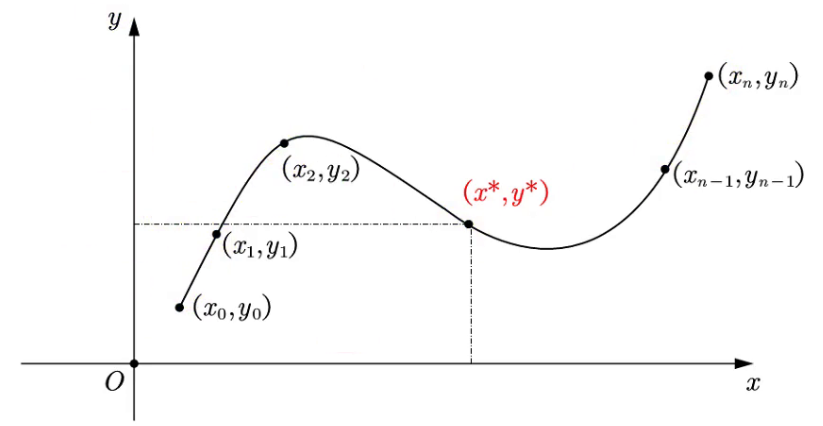
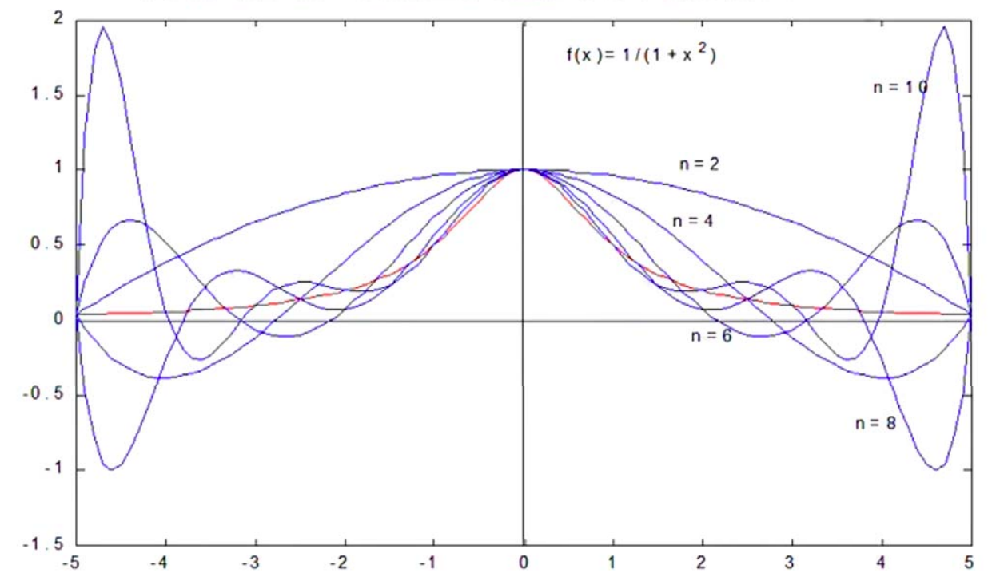
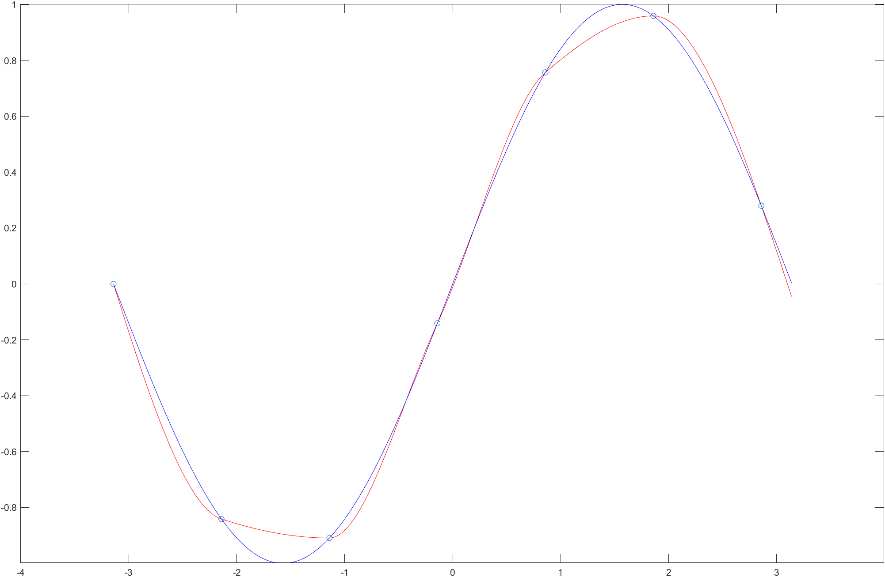

# 插值算法

**插值的作用：**

​	数学建模比赛中，常常需要根据已知的函数点进行数据、模型的处理和分析，而有时候有的**数据极少**，不足以支撑分析的进行，这时就需要使用一些数学的方法来**「模拟产生」**一些新的且比较靠谱的数据，以供我们使用

## 一维插值问题

**问题：**

​	已经有 $n+1$ 个节点 $(x_i, y_i)(i = 0, 1,\cdots,n)$，其中 $x_i$ 互不相同，不妨设 $a = x_0 < x_1<\cdots<x_n =b$，求**任意插值点** $x^*(\neq x_i)$ 处的插值 $y^*$



**思路：**

​	**构造函数** $y = f(x)$，使得 $f(x)$ 过**所有节点**，求 $f(x^*)$ 即可得到 $y^*$

---

为了更好的进行说明，我们在此引入插值的概念

### 插值法的概念

**一般定义：**

​	设函数 $y = f(x)$ 在区间 $[a, b]$ 上有定义，且已知在点 $a \leq x_0 < x_1 < \cdots<x_n \leq b$ 上的值分别为 $y_0, y_1, \cdots, y_n$，若存在一**简单函数** $P(x)$ 使得 $P(x_i) = y_i\ (i = 0, 1, 2,\cdots,n)$，则称 $P(x)$ 为 $f(x)$ 的**插值函数**，点 $x_0, x_1, \cdots, x_n$ 称为**插值节点**，包含插值节点的区间 $[a, b]$ 称为**插值区间**

​	求插值函数 $P(x)$ 的方法成为**插值法**

[^ 1]: 刘春凤：中国大学MOOC 数值计算方法

---

**$P(x)$ 的分类：**

- 若 $P(x)$ 是次数不超过 $n$ 的代数多项式，即 $P(x) = a_0 + a_1x + a_2x^2+\cdots+a_nx^n$，那么就称为`多项式插值`
- 若 $P(x)$ 为分段多项式，那么就称为`分段插值`
- 若 $P(x)$ 为三角多项式，那么就称为`三角插值`
  - **Tips：**三角插值一般需要用到*傅里叶变换*等复杂的数学工具

本篇笔记只讨论**多项式插值**和**分段插值（最常用）**

### 多项式插值法的原理

**定理：**

​	设有 $n+1$ 个互不相同的节点 $(x_i, y_i)\  (i = 0, 1, 2,\cdots,n)$，则存在**唯一多项式**：
$$
L_{n}(x)=a_{0}+a_{1} x+a_{2} x^{2}+\ldots+a_{n} x^{n}
$$
使得 $L_n(x_j) = y_j\ (j = 0, 1, 2,\cdots,n)$

---

**证明：**

​	构造方程组：
$$
\left\{\begin{array}{l}
a_{0}+a_{1} x_{0}+a_{2} x_{0}^{2}+\ldots+a_{n} x_{0}^{n}=y_{0} \\
a_{0}+a_{1} x_{1}+a_{2} x_{1}^{2}+\ldots+a_{n} x_{1}^{n}=y_{1} \\
\ldots \ldots \\
a_{0}+a_{1} x_{n}+a_{2} x_{n}^{2}+\ldots+a_{n} x_{n}^{n}=y_{n}
\end{array}\right.
$$
为了方便计算，我们定义 $A,X,Y$ 如下：
$$
A=\left[\begin{array}{cccc}
1 & x_{0} & \cdots & x_{0}^{n} \\
1 & x_{1} & \cdots & x_{1}^{n} \\
\vdots & \vdots & \ddots & \vdots \\
1 & x_{n} & \cdots & x_{n}^{n}
\end{array}\right] \\
X=\left[\begin{array}{c}
a_{0} \\
a_{1} \\
\vdots \\
a_{n}
\end{array}\right]
,\quad Y=\left[\begin{array}{c}
y_{0} \\
y_{1} \\
\vdots \\
y_{n}
\end{array}\right]
$$
则上述方程组的矩阵形式为 $AX = Y$，其中 $A$ 为*范德蒙行列式*

由于 $|A|=\prod_{i=1}^{n} \prod_{j=0}^{n-1}\left(x_{i}-x_{j}\right) \neq 0$，所以上述方程组有**唯一解**，即 $L_{n}(x)=a_{0}+a_{1} x+a_{2} x^{2}+\ldots+a_{n} x^{n}$ 唯一存在

证毕

 ^ **Tips：**

- 只要 $n+1$ 个节点互异，满足上述插值条件的多项式**是唯一存在的**
- 如果**不限制多项式的次数**（此处限制为 $n$），插值多项式**不唯一**

### 各类插值法

#### 拉格朗日插值法

在数值分析中，`拉格朗日插值法`是一种**多项式插值法**，在若干个不同的观测点得到相应的观测值，拉格朗日插值法可以**找到一个多项式，其恰好在各个观测点取到的观测值**

---

**两点插值：**

​	假设我们有两个点 $(x_0, y_0),(x_1,y_1)$，那么对于这**两个点**的拉格朗日插值为：
$$
f(x) = \frac{x-x_{1}}{x_{0}-x_{1}} y_{0} +\frac{x-x_{0}}{x_{1}-x_{0}} y_{1}
$$

---

**三点插值：**

​	假设我们有三个点 $(x_0, y_0),(x_1,y_1),(x_2, y_2)$，那么对于这**三个点**的拉格朗日插值为：
$$
\begin{aligned}
f(x) &=\frac{\left(x-x_{1}\right)\left(x-x_{2}\right)}{\left(x_{0}-x_{1}\right)\left(x_{0}-x_{2}\right)} y_{0} \\
&+\frac{\left(x-x_{0}\right)\left(x-x_{2}\right)}{\left(x_{1}-x_{0}\right)\left(x_{1}-x_{2}\right)} y_{1} \\
&+\frac{\left(x-x_{0}\right)\left(x-x_{1}\right)}{\left(x_{2}-x_{0}\right)\left(x_{2}-x_{1}\right)} y_{2}
\end{aligned}
$$

---

**四点插值：**

​	假设我们有三个点 $(x_0, y_0),(x_1,y_1),(x_2, y_2),(x_3,y_3)$​，那么对于这**四个点**的拉格朗日插值为：
$$
\begin{aligned}
f(x) &=\frac{\left(x-x_{1}\right)\left(x-x_{2}\right)\left(x-x_{3}\right)}{\left(x_{0}-x_{1}\right)\left(x_{0}-x_{2}\right)\left(x_{0}-x_{3}\right)} y_{0} \\
&+\frac{\left(x-x_{0}\right)\left(x-x_{2}\right)\left(x-x_{3}\right)}{\left(x_{1}-x_{0}\right)\left(x_{1}-x_{2}\right)\left(x_{1}-x_{3}\right)} y_{1} \\
&+\frac{\left(x-x_{0}\right)\left(x-x_{1}\right)\left(x-x_{3}\right)}{\left(x_{2}-x_{0}\right)\left(x_{2}-x_{1}\right)\left(x_{2}-x_{3}\right)} y_{2} \\
&+\frac{\left(x-x_{0}\right)\left(x-x_{1}\right)\left(x-x_{2}\right)}{\left(x_{3}-x_{0}\right)\left(x_{3}-x_{1}\right)\left(x_{3}-x_{2}\right)} y_{3}
\end{aligned}
$$

---

**$n$ 点插值：**

​	通过上面的几个插值举例，我们可以**观察到规律**，并定义如下函数记号 $\omega_{n+1}(x),\omega_{n+1}'(x),l_i(x),L_n(x)$：
$$
\begin{array}{c}
\omega_{n+1}(x)=\left(x-x_{0}\right)\left(x-x_{1}\right) \ldots\left(x-x_{n}\right) \\
\omega_{n+1}^{\prime}\left(x_{k}\right)=\left(x_{k}-x_{0}\right) \ldots\left(x_{k}-x_{k-1}\right)\left(x_{k}-x_{k+1}\right) \ldots\left(x_{k}-x_{n}\right) \\
\end{array}
$$

$$
\begin{aligned}
l_{i}(x) &=\frac{\left(x-x_{0}\right) \cdots\left(x-x_{i-1}\right)\left(x-x_{i+1}\right) \cdots\left(x-x_{n}\right)}{\left(x_{i}-x_{0}\right) \cdots\left(x_{i}-x_{i-1}\right)\left(x_{i}-x_{i+1}\right) \cdots\left(x_{i}-x_{n}\right)} \\
=& \frac{\left.\left(x-x_{0}\right) \cdots\left(x-x_{i-1}\right)\right.\left(x-x_{i}\right)\left(x-x_{i+1}\right) \cdots\left(x-x_{n}\right)}{\left(x-x_{i}\right)\left(x_{i}-x_{0}\right) \cdots\left(x_{i}-x_{i-1}\right)\left(x_{i}-x_{i+1}\right) \cdots\left(x_{i}-x_{n}\right)} \\
&=\frac{\omega_{n+1}(x)}{\left(x-x_{i}\right) \omega^{\prime}{ }_{n+1}\left(x_{i}\right)}
\end{aligned}
$$

$$
L_{n}(x)=\sum_{i=0}^{n} y_{i} l_{i}(x)  = \sum_{k=0}^{n} y_{k} \frac{\omega_{n+1}(x)}{\left(x-x_{k}\right) \omega_{n+1}^{\prime}\left(x_{k}\right)}
$$

#### 牛顿插值法

在此不过多赘述，直接丢公式：
$$
\begin{aligned}
f(x)=& f\left(x_{0}\right)+f\left[x_{0}, x_{1}\right]\left(x-x_{0}\right) \\
&+f\left[x_{0}, x_{1}, x_{2}\right]\left(x-x_{0}\right)\left(x-x_{1}\right)+\cdots \\
&+f\left[x_{0}, x_{1}, \cdots, x_{n-2}, x_{n-1}\right]\left(x-x_{0}\right)\left(x-x_{1}\right) \cdots\left(x-x_{n-3}\right)\left(x-x_{n-2}\right) \\
&+f\left[x_{0}, x_{1}, \cdots, x_{n-1}, x_{n}\right]\left(x-x_{0}\right)\left(x-x_{1}\right) \cdots\left(x-x_{n-2}\right)\left(x-x_{n-1}\right)
\end{aligned}
$$
其中 $f[a, b, \cdots]$ 叫做`差商`，其定义如下：

**一阶差商（亦称均差）：**
$$
f[a, b] = \frac{f(b) - f(a)}{b - a}
$$
**二阶差商：**
$$
f\left[a, b, c\right]=\frac{f\left[b, c\right]-f\left[a, b\right]}{c-a}
$$
**$n$ 阶差商：**
$$
f\left[x_{0}, x_{1}, \ldots, x_{n}\right]=\frac{f\left[x_{1}, \ldots x_{n-1}\left., x_{n}\right]-f\left[x_{0}, x_{1}, \ldots x_{n-1}\right]\right.}{x_{n}-x_{0}}
$$

---

**优点：**具有*继承性*：新增加数据点，可以直接通过原来的公式多加一项。而拉格朗日则需要重新计算

#### 龙格现象（Runge phenomenon）

多项式插值存在**震荡现象**，我们通过下面的例子来说明：

---

设函数 $f(x) = \frac{1}{1 + x^2}, x\in [-5, 5]$

将 $[-5, 5]$ 进行 $n$ 等分，取 $n + 1$ 个节点：$x_i = -5 + ih,h = \frac{10}{n}, u = 0, 1, \cdots, n$

对 $n = 2, 4, 6, 8, 10$ 作 $f(x)$ 的 $n$ 次 [拉格朗日多项式](#拉格朗日插值法)，有
$$
L_{n}(x)=\sum_{j=0}^{n}\left[\frac{1}{1+x_{j}^{2}} \cdot \prod_{i=0 \atop i \neq j}^{n} \frac{\left(x-x_{i}\right)}{\left(x_{j}-x_{i}\right)}\right] \quad n=2,4,6,8,10
$$
将上面推导出的函数进行可视化，我们可以得到函数图像：



可以看到，两端与原函数**相差极大**

---

通过上述例子我们给出龙格现象的定义

**龙格现象：**

​	高次插值会产生*龙格现象*，即在两端处函数波动极大，产生较为明显的震荡

---

故在不熟悉曲线运动趋势的前提下，**不建议使用高次线性插值**

**Tips：**不管是拉格朗日插值，还是牛顿插值，都有龙格现象存在

#### 上述插值法的另一个缺点

上面讲述的两种插值仅仅要求**插值多项式在插值节点处与被插函数处有相等的函数值**，而这种插值多项式却并==不能够全面反映被插函数的形态==

然而在许多实际问题中，不仅要求插值函数与被插函数在所有节点处函数值相同，也需要在一个或全部节点上插值多项式与被插函数具有相同的低阶甚至高阶的导数值

对于这些情况，拉格朗日插值和牛顿插值都**不能满足**

#### 分段线性插值

上面**高次线性拉格朗日插值法**的弊端总结如下：

- 插值多项式次数高精度未必提高
- 插值多项式次数越高，摄入误差可能会显著增大

那么，如何**提高插值精度**呢？其中一种解决办法是采用`分段线性插值`

什么是分段呢？上面拉格朗日插值法，考虑的 $n$ 为全局的 $n$ ，而分段的意思就是，只对一小部分的区域分别进行插值，不考虑全局次数，将式子**分解为多个低次函数**

---

##### 分段二次（抛物）插值

选取与 $x$ 最近的三个节点 $x_{i - 1},x_{i},x_{i + 1}$，进行二次拉格朗日插值

即在每一个区间 $[x_{i - 1}, x_{i  +1}]$ 上，取：
$$
f(x) \approx L_{2}(x)=\sum_{k=i-1}^{i+1}\left[y_{k} \prod_{j=i-1 \atop j \neq k}^{i+1} \frac{\left(x_{i}-x_{j}\right)}{\left(x_{k}-x_{i}\right)}\right]
$$
就得到了我们在这一分段上的插值函数 $f(x)$

这种分段的低次插值成为**分段二次插值**，在几何上的理解就是使用抛物线代替 $y = f(x)$ ，故也被称为**分段抛物插值**

#### 埃尔米特（Hermite）插值

- 具有节点的**导数值约束**的插值

对于被插函数 $\varphi(x)$，**较低的要求**为：
$$
\varphi\left(x_{i}\right)=y_{i} \quad(i=0,1,2, \ldots n)
$$
**较高的要求**为：
$$
\begin{array}{ll}
\varphi\left(x_{i}\right)=y_{i} & (i=0,1,2, \ldots n) \\
\varphi^{\prime}\left(x_{i}\right)=y_{i}^{\prime} & (i=0,1,2, \ldots n)
\end{array}
$$
即不但要求节点上的函数值相等，而且还要求对应的导数值也相等，甚至要求高阶导数也相等，**满足这种要求**的插值多项式就是埃尔米特插值多项式

---

设 $f(x)$ 在区间 $[a, b]$ 上有 $n+1$ 个互异节点，$a=x_{0}<x_{1}<x_{2}<\ldots<x_{\mathrm{n}}=b$，定义在 $[a, b]$ 上函数 $f(x)$ 在节点上满足：
$$
f\left(x_{i}\right)=y_{i}, f^{\prime}\left(x_{i}\right)=y_{i}^{\prime} \quad(i=0,1,2, \ldots n)
$$
 ^ 共 $2(n+1)$ 个条件

则可唯一确定一个次数不超过 $2n+1$​ 的多项式 $H_{2n+1}(x) = H(x)$​，满足：
$$
H\left(x_{i}\right)=y_{i}, H^{\prime}\left(x_{i}\right)=y_{i}^{\prime} \quad(i=0,1,2, \ldots n)
$$
其余项为：
$$
R(x)=f(x)-H(x)=\frac{f^{(2 n+2)}(\xi)}{(2 n+2) !} \omega_{2 n+2}(x)
$$

---

我们在实际建模过程中并不需要了解其证明过程，只需要知道：

**「分段三次埃尔米特插值（PCHIP）」**是数学建模比赛中最常见的插值算法

#### 分段三次埃尔米特插值

直接使用埃尔米特插值得到的多项式**次数较高**，也存在着**龙格现象**

因此在**实际应用**中，往往使用分段三次埃尔米特插值多项式（PCHIP）

MATLAB 内置了这个算法，可以非常方便的进行调用：`pchip(x, y, new_x)`

 ^ x 是已知样本点的横坐标；y 是已知样本点的纵坐标；new_x 是要插入处对应的横坐标

---

直接上代码：

```matlab
% 定义 x 为步长为1，-pi到pi
x = -pi:pi;
% 定义 x 对应的 y
y = sin(x);
% 定义 new_x 步长变为 0.01
new_x = -pi:0.01:pi;
% 使用埃尔米特三次分段拟合，结果为 p
p = pchip(x, y, new_x);
% 分别画出 原始点的位置、拟合后的曲线、原始sinx的图像
plot(x, y, 'o', new_x, p, 'r-', new_x, sin(new_x), 'b-')
```

效果如图所示：



#### 三次样条插值

设 $y = f(x)$ 在点 $x_0, x_1, x_2,\cdots,x_n$ 的值为 $y_0, y_1, y_2,\cdots,y_n$，若函数 $S(x)$ 满足下列条件：

- $S(x_i) = f(x_i) = y_i\ (i = 0, 1, 2,\cdots, n)$
- 在每个子区间