# 拟合算法

​	与插值问题不同，在拟合问题中**不需要曲线一定经过给定的点**，拟合问题的目标是寻求一个函数（曲线），使得该曲线在某种准则下与所有的**数据点最为接近**，即曲线拟合的最好（最小化损失函数）

## 插值和拟合的区别

插值算法中，得到的多项式 $f(x)$ 要经过所有的样本点，但如果样本点**太多**，那么这个多项式次数就会过高，会造成`龙格现象（请看 3-插值算法#龙格现象）`

尽管我们可以选择分段的方法避免这种现象，但是更多的时候我们希望得到一个确定的曲线，尽管这条曲线不能经过每一个样本点，但只要保证**误差足够小**即可，这就是拟合的思想

 ^ **Tips：**拟合的结果是一个**确定的曲线**

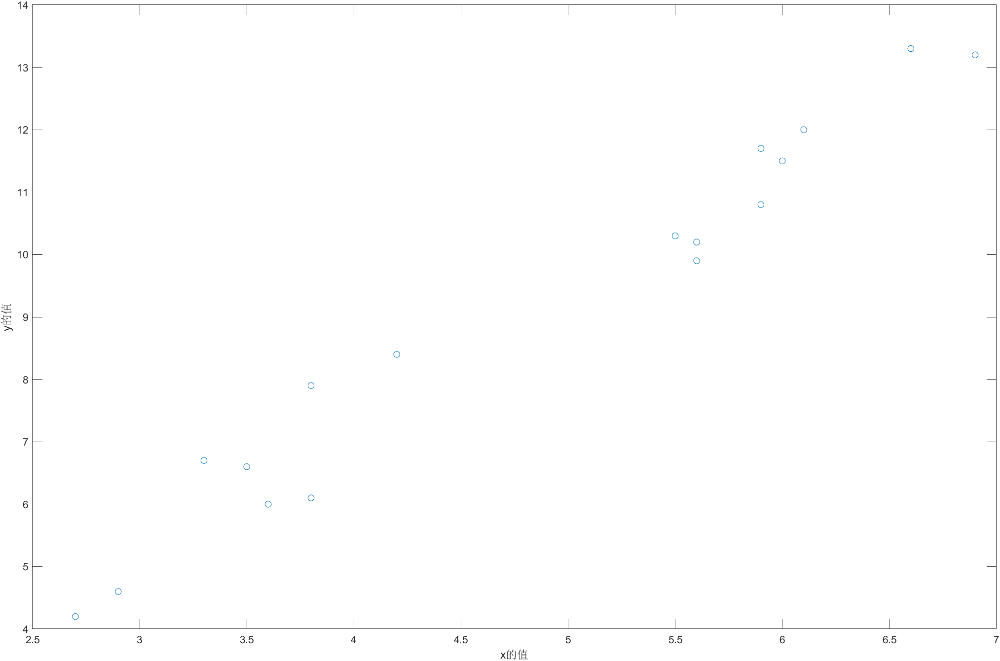

如图，此类的样本点就不适合进行插值操作，因为插出来的曲线肯定是奇形怪状的；而我们肉眼直观感受，可以大致猜出这些样本点分布是在一条直线上，所以对于**此类数据我们更倾向于拟合**

## MATLAB 使用小技巧

### 数据的导入

我们除了直接在工作区输入数据之外，还可以通过 Excel 进行数据的导入

如何操作呢？很简单：

假设我们有数据 $x, y$ 存储在 Excel 表格中

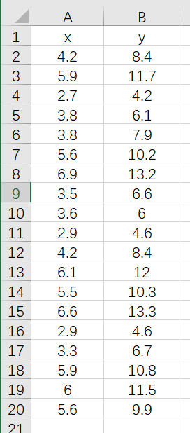

在 MATLAB 中的`工作区`直接新建变量 $x,y$ 

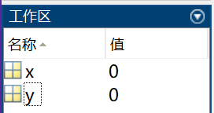

双击 $x$，然后会打开一个表格，直接把 Excel 中的表格数据选择、复制、粘贴即可；$y$ 同理

这样我们就可以直接使用导入的数据啦！

```matlab
size(x)
```

```matlab
ans =

    19     1
```

### 数据的保存

在工作区右键可以对数据进行保存操作，快捷键为 `Ctrl+S`

经过保存的数据会以`.mat`拓展名的**文件格式**进行存储，可以很方便的进行传输和管理

### .mat 文件的加载

直接使用`load`关键字即可进行数据的加载

比如数据文件的名称为`data1.mat`，那么通过如下代码直接可以进行加载：

```matlab
load data1
```

### 散点图的绘制

经过加载数据后，通过如下代码进行散点图的绘制：

```matlab
load data1
plot(x, y, 'o');
xlabel('x的值');
ylabel('y的值');
```

绘制出的图形为[插值和拟合的区别](#插值和拟合的区别)一节的示意图

## 确定拟合曲线

### 最小二乘法

​	假设有一系列样本点 $(x_i, y_i),i = 1, 2, \cdots,n$，我们设**拟合曲线**为 $y = kx+b$

**问：**

​	$k$ 和 $b$ 取何值时，样本点和拟合曲线**最为接近**

---

针对上面的问题，我们在此引出`最小二乘法`的概念

#### 几何解释

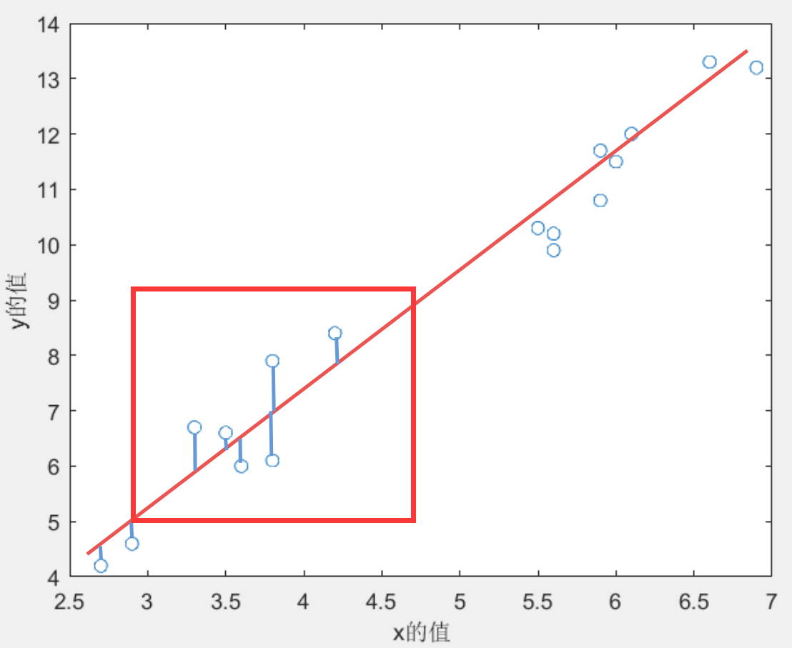

#### 最小二乘法的两种定义

##### 第一种

$$
\hat{y}_{i}=k x_{i}+b\\
\hat{k}, \hat{b}=\underset{k, b}{\arg \min }\left(\sum\limits_{i=1}^{n}\left|y_{i}-\hat{y}_{i}\right|\right)
$$

上面这种定义，其式子中带有**绝对值**，不利于求导，因此**计算比较复杂**，所以我们往往在实际中采用下面的第二种定义

---

##### 第二种

$$
\hat{y}_{i}=k x_{i}+b\\
\hat{k}, \hat{b}=\underset{k, b}{\arg \min }\left(\sum\limits_{i=1}^{n}\left(y_{i}-\hat{y}_{i}\right)^2\right)
$$

那么既然是为了抵消绝对值，为什么不用 $(\cdot)^4,(\cdot)^6$ ？

- 避免**极端数据**对拟合曲线的影响（二次方温柔一些）
- 最小二乘法得到的结果和`MLE 极大似然估计法`一致

---

现在我们得知了最小二乘法的定义式，那么如何进行求解呢？

由 $\hat{y}_{i}=k x_{i}+b$我们可以得到：
$$
\hat{k}, \hat{b}=\underset{k, b}{\arg \min }\left(\sum_{i=1}^{n}\left(y_{i}-\hat{y}_{i}\right)^{2}\right)=\underset{k, b}{\arg \min }\left(\sum_{i=1}^{n}\left(y_{i}-k x_{i}-b\right)^{2}\right)
$$
那么我们定义损失函数（回归分析中也叫`残差平方和`） $L$
$$
L=\sum_{i=1}^{n}\left(y_{i}-k x_{i}-b\right)^{2}
$$
我们需要做的事变为：找到 $k,b$ 使得 $L$ 最小，则根据偏导数知识我们可以得到如下公式：
$$
\left\{\begin{array} { l } 
{ \frac { \partial L } { \partial k } = - 2 \sum\limits _ { i = 1 } ^ { n } x _ { i } ( y _ { i } - k x _ { i } - b ) = 0 } \\
{ \frac { \partial L } { \partial b } = - 2 \sum\limits _ { i = 1 } ^ { n } ( y _ { i } - k x _ { i } - b ) = 0 }
\end{array} \Rightarrow \left\{\begin{array} { l } 
{ \sum\limits _ { i = 1 } ^ { n } x _ { i } y _ { i } = k \sum\limits _ { i = 1 } ^ { n } x _ { i } ^ { 2 } + b \sum\limits _ { i = 1 } ^ { n } x _ { i } } \\
{ \sum\limits _ { i = 1 } ^ { n } y _ { i } = k \sum\limits _ { i = 1 } ^ { n } x _ { i } + b n }
\end{array} \Rightarrow \left\{\begin{array}{l}
n \sum\limits_{i=1}^{n} x_{i} y_{i}=k n \sum\limits_{i=1}^{n} x_{i}^{2}+b n \sum\limits_{i=1}^{n} x_{i} \\
\sum\limits_{i=1}^{n} y_{i} \sum\limits_{i=1}^{n} x_{i}=k \sum\limits_{i=1}^{n} x_{i} \sum\limits_{i=1}^{n} x_{i}+b n \sum\limits_{i=1}^{n} x_{i}
\end{array}\right.\right.\right.
$$
上下作差有：
$$
n \sum\limits_{i=1}^{n} x_{i} y_{i}-\sum\limits_{i=1}^{n} y_{i} \sum\limits_{i=1}^{n} x_{i}=k n \sum\limits_{i=1}^{n} x_{i}^{2}-k \sum\limits_{i=1}^{n} x_{i} \sum\limits_{i=1}^{n} x_{i} \Rightarrow \hat{k}=\frac{n \sum\limits_{i=1}^{n} x_{i} y_{i}-\sum\limits_{i=1}^{n} y_{i} \sum\limits_{i=1}^{n} x_{i}}{n \sum\limits_{i=1}^{n} x_{i}^{2}-\sum\limits_{i=1}^{n} x_{i} \sum\limits_{i=1}^{n} x_{i}}
$$
同理，有：
$$
\hat{b}=\frac{\sum\limits_{i=1}^{n} x_{i}^{2} \sum\limits_{i=1}^{n} y_{i}-\sum\limits_{i=1}^{n} x_{i} \sum\limits_{i=1}^{n} x_{i} y_{i}}{n \sum\limits_{i=1}^{n} x_{i}^{2}-\sum\limits_{i=1}^{n} x_{i} \sum\limits_{i=1}^{n} x_{i}}
$$
总结以下，对于最小二乘法，我们所需要求的 $\hat{k},\hat{b}$ 分别为：
$$
\hat{k}=\frac{n \sum\limits_{i=1}^{n} x_{i} y_{i}-\sum\limits_{i=1}^{n} y_{i} \sum\limits_{i=1}^{n} x_{i}}{n \sum\limits_{i=1}^{n} x_{i}^{2}-\sum\limits_{i=1}^{n} x_{i} \sum\limits_{i=1}^{n} x_{i}}，\hat{b}=\frac{\sum\limits_{i=1}^{n} x_{i}^{2} \sum\limits_{i=1}^{n} y_{i}-\sum\limits_{i=1}^{n} x_{i} \sum\limits_{i=1}^{n} x_{i} y_{i}}{n \sum\limits_{i=1}^{n} x_{i}^{2}-\sum\limits_{i=1}^{n} x_{i} \sum\limits_{i=1}^{n} x_{i}}
$$

#### MATLAB 最小二乘拟合

```matlab
clear;clc
load  data1
plot(x,y,'o')
% 给x和y轴加上标签
xlabel('x的值')
ylabel('y的值')
n = size(x,1);
k = (n*sum(x.*y)-sum(x)*sum(y))/(n*sum(x.*x)-sum(x)*sum(x))
b = (sum(x.*x)*sum(y)-sum(x)*sum(x.*y))/(n*sum(x.*x)-sum(x)*sum(x))
hold on % 继续在之前的图形上来画图形
grid on % 显示网格线
f=@(x) k*x+b;
fplot(f,[2.5,7]);
legend('样本数据','拟合函数','location','SouthEast')
```


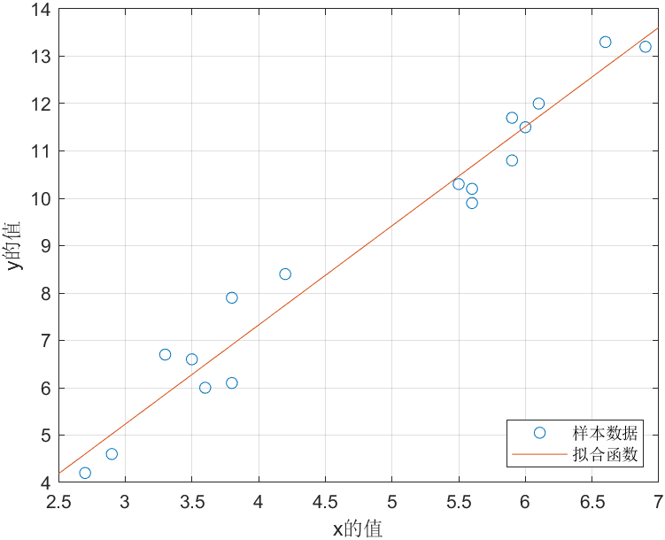

## 拟合质量评价

在此抛出几个概念：

**总体平方和** $SST$（Total Sum of Squares）：
$$
S S T=\sum_{i=1}^{n}\left(y_{i}-\bar{y}\right)^{2}
$$
**误差平方和** $SSE$（The Sum of Squares due to Error）：
$$
S S E=\sum_{i=1}^{n}\left(y_{i}-{\hat{y}}\right)^{2}
$$
**回归平方和** $SSR$（The Sum of Squares of the Regression）：
$$
S SR=\sum_{i=1}^{n}\left(\hat{y}_{i}-\bar{y}\right)^{2}
$$
**拟合优度**（可决系数）$R^2$：
$$
0 \leq R^{2}=\frac{S S R}{S S T}=\frac{S S T-S S E}{S S T}=1-\frac{S S E}{S S T} \leq 1
$$

---

接下来是一些特性：

- $SST = SSE + SSR$
  - ​	证明过程略

- $R^2$ 越接近 $1$ 说明误差平方和越接近 $0$，误差越小说明拟合的越好
- $R^2$ 只能用于**线性函数拟合结果**的评价
  - 线性函数和其他函数（如指数函数）比较拟合的好坏时，直接看 $SSE$ 即可
  - $R^2$ 可能为负数

---

### 辨析：线性函数

有一个小问题：$y = x+bx^2$ 是线性函数吗？

答案：**是线性函数**

需要辨析的是：我们在本节所提到的线性函数，指的其实是**对参数为线性（线性于参数）**的函数

---

那么我们如何判定这个函数是不是**线性于参数的函数**呢？

- 在函数中，参数仅以**一次方**形式出现
- 出现的参数**不能 $\times ÷$ 任何其他的参数**
- **不能出现参数的复合函数形式**

例如，下列的函数均**不是**线性于参数的函数
$$
y = \frac{a}{(x - b) ^ 2}\\
y   = a\sin(b + cx)
$$

### 拟合优先度计算代码

```matlab
clear;clc
load  data1
plot(x,y,'o')
% 给x和y轴加上标签
xlabel('x的值')
ylabel('y的值')
n = size(x,1);
k = (n*sum(x.*y)-sum(x)*sum(y))/(n*sum(x.*x)-sum(x)*sum(x))
b = (sum(x.*x)*sum(y)-sum(x)*sum(x.*y))/(n*sum(x.*x)-sum(x)*sum(x))
hold on % 继续在之前的图形上来画图形
grid on % 显示网格线
f=@(x) k*x+b;
fplot(f,[2.5,7]);
legend('样本数据','拟合函数','location','SouthEast')
y_hat = k*x+b; % y的拟合值
SSR = sum((y_hat-mean(y)).^2)  % 回归平方和
SSE = sum((y_hat-y).^2) % 误差平方和
SST = sum((y-mean(y)).^2) % 总体平方和
SST-SSE-SSR   % 5.6843e-14  =   5.6843*10^-14   matlab浮点数计算的一个误差
R_2 = SSR / SST
```

```
SSR = 151.1583
SSE = 5.7281
SST = 156.8863
R_2 = 0.9635
```

## 拟合工具箱 CFTOOL 的使用

在 MATLAB 中键入 `cftool` 即可启动**拟合工具箱**

---

使用方式简洁明了，接下来进行一些说明：

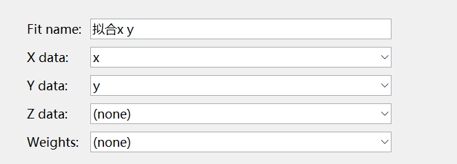

上图中，Fit name 是本次拟合的**名称**；最多支持**三维数据**的拟合；Weights 是**每个数据点对应的权重**，其符合 $\text{size}(x) = \text{size}(w)$

---

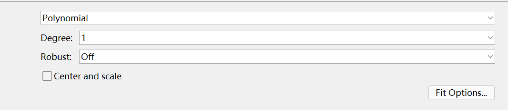

上图中，第一个选择框为使用的**拟合方法**，在这里为 Polynomial（多项式拟合）；Degree 为**多项式次数**；Robost 为所要使用的**鲁棒性增强方法**，可选的有 `LAR`和 `Bisquare`

- LAR：Least Absolute Residual（最小绝对残差），以**残差平方最小为目标**进行拟合
- Bisquare：根据距离拟合线的距离加权，有些**异常值**权重为 $0$，相当于对其进行**剔除**

其中，**拟合方法列举**如下：

- Custom Equations 用户自定义函数==（常用）==
- Expotential  $e$ 的指数函数
- Fourier 傅立叶函数，含有三角函数
- Gaussian 正态分布函数，高斯函数
- Interpolant 插值函数，含有线性函数、移动平均等类型的拟合
- Polynomial 多项式函数==（常用）==
- Power 幂函数
- Rational 有理函数
- Smooth Spline 平滑样条，具体请看[MATLAB Smoothing Spline 拟合](https://blog.csdn.net/Cui_Hongwei/article/details/110482212)
- Sum of sin functions 正弦函数类
- Weibull 威布尔函数

---

接下来说明**左边框框内的数据**：

```
Linear model Poly1:
     f(x) = p1*x + p2
Coefficients (with 95% confidence bounds):
       p1 =       2.095  (1.886, 2.304)
       p2 =      -1.055  (-2.072, -0.03775)

Goodness of fit:
  SSE: 5.728
  R-square: 0.9635
  Adjusted R-square: 0.9613
  RMSE: 0.5805
```

f(x) 是拟合得到的**函数**；后续跟随的为**参数的信息**；参数后的括号内为**置信区间**；SSE 为**误差平方和**；R-square 为**拟合优度**；Adjusted R-square 为**调整了自由度的拟合优度**；RMSE 为**均方误差（深度学习常用损失函数）**

## 使用 CFTOOL 进行人口预测

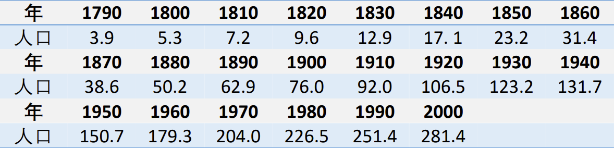

上图是一些人口数据，请使用下面给出的函数进行人口预测：
$$
x(t)=\frac{x_{m}}{1+\left(\frac{x_{m}}{3.9}-1\right) e^{-r(t-1790)}}
$$
在 `cftool` 中进行下图所示的操作：

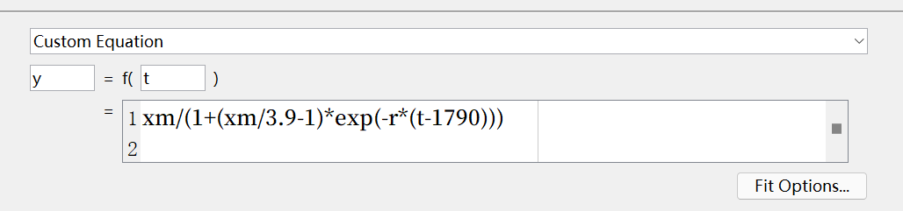

生成代码，修改，得到结果：

```matlab
clear;clc
year = 1790:10:2000;
population = [3.9,5.3,7.2,9.6,12.9,17.1,23.2,31.4,38.6,50.2,62.9,76.0,92.0,106.5,123.2,131.7,150.7,179.3,204.0,226.5,251.4,281.4];
cftool  % 拟合工具箱
% (1) X data 选择 year
% (2) Y data 选择 population
% (3) 拟合方式选择：Custom Equation (自定义方程)
% (4) 修改下方的方框为：x = f(t) = xm/(1+(xm/3.9-1)*exp(-r*(t-1790)))
% (5) 左边的result一栏最上面显示：Fit computation did not converge:即没有找到收敛解，右边的拟合图形也表明拟合结果不理想
% (6) 点击Fit Options，修改非线性最小二乘估计法拟合的初始值(StartPoint), r修改为0.02，xm修改为500
% (7) 此时左边的result一览得到了拟合结果：r = 0.02735, xm = 342.4
% (8) 依次点击拟合工具箱的菜单栏最左边的文件—Generate Code(导出代码到时候可以放在你的论文附录)，可以得到一个未命名的脚本文件
% (9) 在这个打开的脚本中按快捷键Ctrl+S，将这个文件保存到当前文件夹。
% (10) 在现在这个文件中调用这个函数得到参数的拟合值和预测的效果
[fitresult, gof] = createFit(year, population)
t = 2001:2030;
xm = 342.4;   
r =  0.02735;
predictions = xm./(1+(xm./3.9-1).*exp(-r.*(t-1790)));  % 计算预测值（注意这里要写成点乘和点除,这样可以保证按照对应元素进行计算）
figure(2)
plot(year,population,'o',t,predictions,'.')  % 绘制预测结果图
```

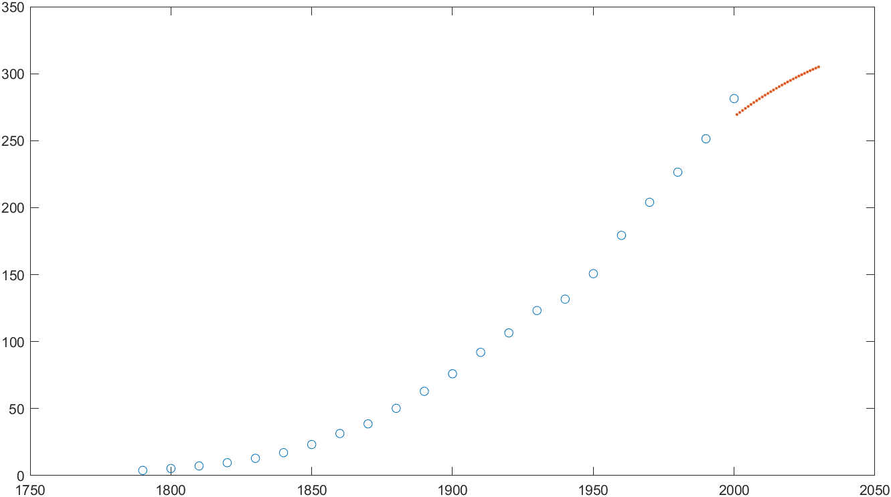

### 另解

不适用给定的函数，进行探究，发现**高斯函数拟合比较好**

**设置：**

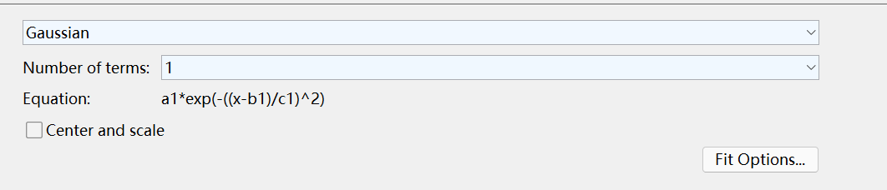

**结果：**

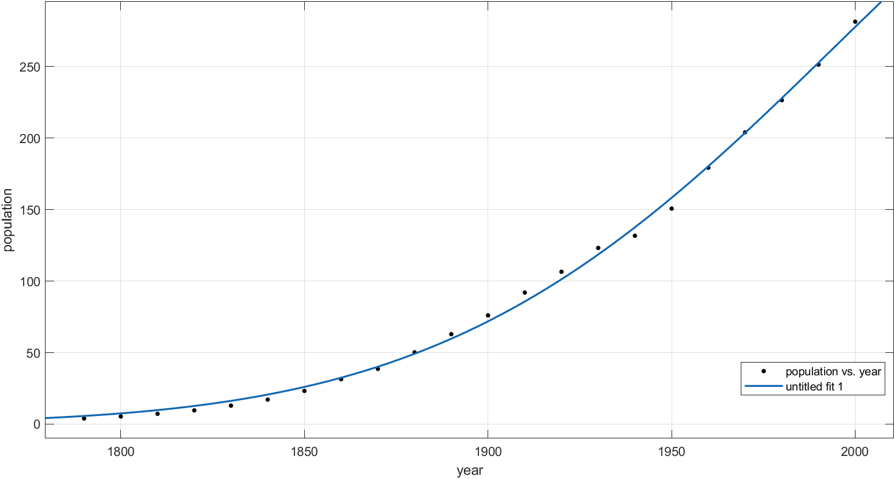

**代码：**

```matlab
clear;clc
year = 1790:10:2000;
population = [3.9,5.3,7.2,9.6,12.9,17.1,23.2,31.4,38.6,50.2,62.9,76.0,92.0,106.5,123.2,131.7,150.7,179.3,204.0,226.5,251.4,281.4];
[fitresult, gof] = createFit(year, population)
t = 2001:2030;
a1 =       433.2 
b1 =        2099 
c1 =       148.5 
predictions = a1*exp(-((t-b1)/c1).^2)
figure(2)
plot(year,population,'o',t,predictions,'.')  % 绘制预测结果图
```

**预测：**

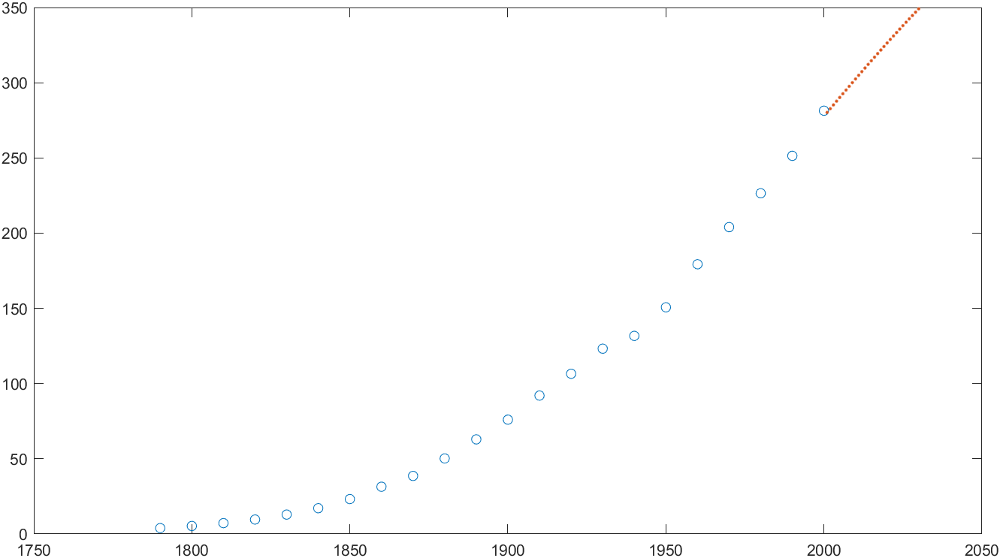