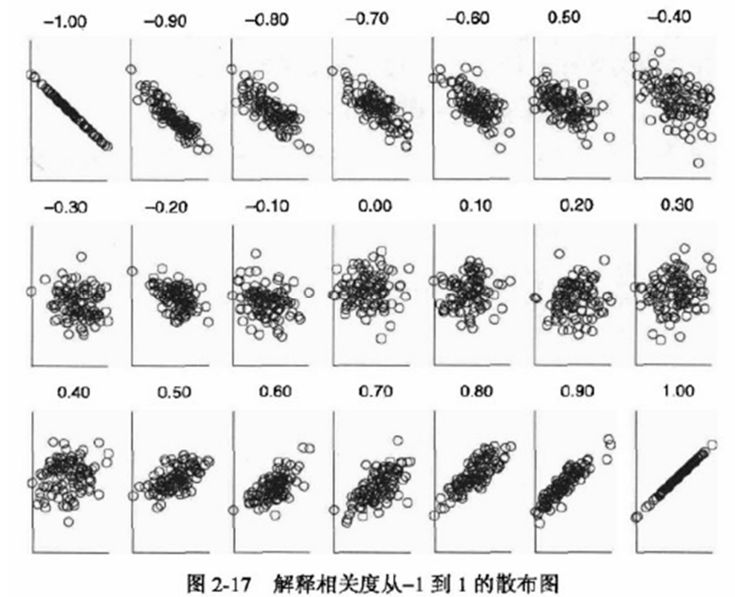

# 相关系数

相关系数可以用来**衡量两个变量之间的相关性大小**，根据数据满足的不同条件，我们**需要选择不同的相关系数**进行计算和分析

## 总体和样本

**总体：**

​	所要**考察对象的全部个体叫做总体**

​	我们总是希望得到总体数据的一些特征

**样本：**

​	从总体中所**抽取的一部分个体叫做总体的一个样本**

**样本估计总体：**

- 样本均值估计总体均值（平均水平）
- 样本标准差估计总体标准差（偏离程度）

## Person 相关系数

**Tips：**一般我们直接说**「相关系数」**，指的就是 Person 相关系数

### 定义

设有两组数据 $X:\{X_1, X_2,\cdots,X_n\},Y:\{Y_1,Y_,\cdots,Y_n\}$，是总体数据（例如人口普查结果），那么有如下定义：

**总体均值：**
$$
E(X)=\frac{\sum\limits_{i=1}^{n} X_{i}}{n}, E(Y)=\frac{\sum\limits_{i=1}^{n} Y_{i}}{n}
$$
**总体协方差：**
$$
\operatorname{Cov}(X, Y)=\frac{\sum\limits_{i=1}^{n}\left(X_{i}-E(X)\right)\left(Y_{i}-E(Y)\right)}{n}
$$

---

### 协方差的直观理解

通过上面的协方差定义公式，我们可以看出来，协方差每一次所累加的**乘积**，其**正负均由 $X,Y$ 的变化方向共同决定**

其中当变化方向相同时，乘积为**正**；变化方向相反时，乘积为**负**

那么我们可以得到：

-  $X,Y$ 的变化方向**一直相同**时，协方差为**正**
- $X,Y$ 的变化方向**一直相反**时，协方差为**负**
- $X,Y$ 的变化方向**没有规律**时，协方差在计算过程中**正负抵消**

**Tips：**协方差的大小和两个变量的**量纲**有关，因此**不适合作比较**

---

**总体 Pearson 相关系数：**
$$
\rho_{X Y}=\frac{\operatorname{Cov}(X, Y)}{\sigma_{X} \sigma_{Y}}=\frac{\sum\limits_{i=1}^{n} \frac{\left(X_{i}-E(X)\right)}{\sigma_{X}} \frac{\left(Y_{i}-E(Y)\right)}{\sigma_{Y}}}{n}
$$
 ^ 其中 $\sigma_X,\sigma_Y$ 是 $X$ 的**标准差**：
$$
\sigma_{X}=\sqrt{\frac{\sum\limits_{i=1}^{n}\left(X_{i}-E(X)\right)^{2}}{n}}, \sigma_{Y}=\sqrt{\frac{\sum\limits_{i=1}^{n}\left(Y_{i}-E(Y)\right)^{2}}{n}}
$$
**性质：**

​	可以证明，$|\rho_{XY}|\leq 1$，且当 $Y = aX+b$ 时，$\rho_{X Y}=\left\{\begin{array}{cc}1, & a>0 \\-1, & a<0\end{array}\right.$

**简易理解：**

Person 相关系数也可以看作**剔除了量纲的影响**，**将 $X,Y$ 标准化后的协方差**

### 样本皮尔逊相关系数

设有两组数据 $X:\{X_1, X_2,\cdots,X_n\},Y:\{Y_1,Y_,\cdots,Y_n\}$，是样本数据（例如问卷调查），那么有如下定义：

**样本均值：**
$$
\bar{X}=\frac{\sum_{i=1}^{n} X_{i}}{n}, \bar{Y}=\frac{\sum_{i=1}^{n} Y_{i}}{n}
$$
**样本协方差：**
$$
\operatorname{Cov}(X, Y)=\frac{\sum\limits_{i=1}^{n}\left(X_{i}-\bar{X}\right)\left(Y_{i}-\bar{Y}\right)}{n-1}
$$
 ^ 注意 $n - 1$

**样本 Person 相关系数：**
$$
r_{X Y}=\frac{\operatorname{Cov}(X, Y)}{S_{X} S_{Y}}
$$
 ^ 其中 $S_X$ 是 $X$ 的**样本标准差**：
$$
S_{X}=\sqrt{\frac{\sum\limits_{i=1}^{n}\left(X_{i}-\bar{X}\right)^{2}}{n-1}},  S_{Y}=\sqrt{\frac{\sum\limits_{i=1}^{n}\left(Y_{i}-\bar{Y}\right)^{2}}{n-1}}
$$

---

可以看到，样本相关系数的差别就在于分母为 $n - 1$，在此不深究原因

### 可视化

下图为可视化所对应的散点图状态：

##  Spearman 相关系数

