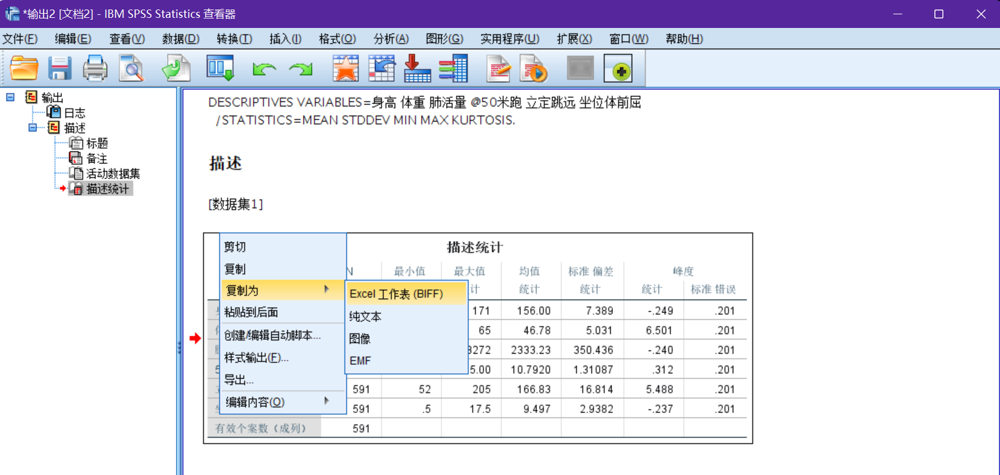

# 皮尔逊相关系数

相关系数可以用来**衡量两个变量之间的相关性大小**，根据数据满足的不同条件，我们**需要选择不同的相关系数**进行计算和分析

## 总体和样本

**总体：**

​	所要**考察对象的全部个体叫做总体**

​	我们总是希望得到总体数据的一些特征

**样本：**

​	从总体中所**抽取的一部分个体叫做总体的一个样本**

**样本估计总体：**

- 样本均值估计总体均值（平均水平）
- 样本标准差估计总体标准差（偏离程度）

## Person 相关系数

**Tips：**一般我们直接说**「相关系数」**，指的就是 Person 相关系数

### 定义

设有两组数据 $X:\{X_1, X_2,\cdots,X_n\},Y:\{Y_1,Y_,\cdots,Y_n\}$，是总体数据（例如人口普查结果），那么有如下定义：

**总体均值：**
$$
E(X)=\frac{\sum\limits_{i=1}^{n} X_{i}}{n}, E(Y)=\frac{\sum\limits_{i=1}^{n} Y_{i}}{n}
$$
**总体协方差：**
$$
\operatorname{Cov}(X, Y)=\frac{\sum\limits_{i=1}^{n}\left(X_{i}-E(X)\right)\left(Y_{i}-E(Y)\right)}{n}
$$

---

### 协方差的直观理解

通过上面的协方差定义公式，我们可以看出来，协方差每一次所累加的**乘积**，其**正负均由 $X,Y$ 的变化方向共同决定**

其中当变化方向相同时，乘积为**正**；变化方向相反时，乘积为**负**

那么我们可以得到：

-  $X,Y$ 的变化方向**一直相同**时，协方差为**正**
- $X,Y$ 的变化方向**一直相反**时，协方差为**负**
- $X,Y$ 的变化方向**没有规律**时，协方差在计算过程中**正负抵消**

**Tips：**协方差的大小和两个变量的**量纲**有关，因此**不适合作比较**

---

**总体 Pearson 相关系数：**
$$
\rho_{X Y}=\frac{\operatorname{Cov}(X, Y)}{\sigma_{X} \sigma_{Y}}=\frac{\sum\limits_{i=1}^{n} \frac{\left(X_{i}-E(X)\right)}{\sigma_{X}} \frac{\left(Y_{i}-E(Y)\right)}{\sigma_{Y}}}{n}
$$
 ^ 其中 $\sigma_X,\sigma_Y$ 是 $X$ 的**标准差**：
$$
\sigma_{X}=\sqrt{\frac{\sum\limits_{i=1}^{n}\left(X_{i}-E(X)\right)^{2}}{n}}, \sigma_{Y}=\sqrt{\frac{\sum\limits_{i=1}^{n}\left(Y_{i}-E(Y)\right)^{2}}{n}}
$$
**性质：**

​	可以证明，$|\rho_{XY}|\leq 1$，且当 $Y = aX+b$ 时，$\rho_{X Y}=\left\{\begin{array}{cc}1, & a>0 \\-1, & a<0\end{array}\right.$

**简易理解：**

Person 相关系数也可以看作**剔除了量纲的影响**，**将 $X,Y$ 标准化后的协方差**

### 样本皮尔逊相关系数

设有两组数据 $X:\{X_1, X_2,\cdots,X_n\},Y:\{Y_1,Y_,\cdots,Y_n\}$，是样本数据（例如问卷调查），那么有如下定义：

**样本均值：**
$$
\bar{X}=\frac{\sum_{i=1}^{n} X_{i}}{n}, \bar{Y}=\frac{\sum_{i=1}^{n} Y_{i}}{n}
$$
**样本协方差：**
$$
\operatorname{Cov}(X, Y)=\frac{\sum\limits_{i=1}^{n}\left(X_{i}-\bar{X}\right)\left(Y_{i}-\bar{Y}\right)}{n-1}
$$
 ^ 注意 $n - 1$

**样本 Person 相关系数：**
$$
r_{X Y}=\frac{\operatorname{Cov}(X, Y)}{S_{X} S_{Y}}
$$
 ^ 其中 $S_X$ 是 $X$ 的**样本标准差**：
$$
S_{X}=\sqrt{\frac{\sum\limits_{i=1}^{n}\left(X_{i}-\bar{X}\right)^{2}}{n-1}},  S_{Y}=\sqrt{\frac{\sum\limits_{i=1}^{n}\left(Y_{i}-\bar{Y}\right)^{2}}{n-1}}
$$

---

可以看到，样本相关系数的差别就在于分母为 $n - 1$，在此不深究原因

### 可视化

下图为可视化所对应的散点图状态：


### 皮尔逊相关系数理解误区


 ^ <a id="图1">图1</a> 上面四个图中的数据点的相关系数均为 $0.816$

图一可以大致正确反映数据之间的联系；图二为二次函数，也能略微反映；但图三和图四均存在**异常点**，而**异常点对皮尔逊相关系数的影响非常大**

通过公式：
$$
\operatorname{Cov}(X, Y)=\frac{\sum\limits_{i=1}^{n}\left(X_{i}-\bar{X}\right)\left(Y_{i}-\bar{Y}\right)}{n-1}
$$
我们可以发现，如果**去掉图四的异常点**，那么其相关系数计算结果为 $0$（$X,Y$ 之间**没有关系**）

因为假设我们将 $X$ 设为定值，则 $X_i = \bar{X}$，故计算结果始终为 $0$

---

下图是一个**冰激凌的销量与温度**的散点数据图：


 ^ <a id="图2">图2</a> 上图的皮尔逊相关系数计算结果为 $0$

通过计算结果我们可以推导出：$X,Y$ 无关！

但这是不正确的，我们直观看来**显然有关**，且呈二次函数关系

---

> In statistics, the Pearson product-moment correlation coefficient is a measure of the **linear** correlation (dependence) between two variables X and Y, giving a value between +1 and −1 inclusive, where 1 is total positive correlation, 0 is no correlation, and −1 is total negative correlation. It is widely used in the sciences as a measure of the degree of **linear** dependence between two variables. 
>
> ——Wikipedia

 ^ 上面加粗字体部分为**「线性」**这是皮尔逊相关系数所需要强调的地方

- 皮尔逊相关系数只表示两组数据的**线性相关程度**
- 皮尔逊相关系数**只能用在事先确定好为线性相关的数据**中

#### 容易忽视/犯错的点

- **非线性相关**也会导致线性相关系数很大，如[图1](#图1)的第一幅图
- **离群点**对相关系数的影响很大，如[图1](#图1)的第二幅图（去掉离群点后相关系数变为 $0.98$）
- 相关性系数计算结果为 $0$，**只能说明其不是线性相关**，可能会有更加复杂的关系，如[图2](#图2)

---

所以在使用过程中，皮尔逊相关系数要慎用

使用之前**一定要绘制数据点**，**人工判断**其数据合理性，**再决定**要不要使用皮尔逊相关系数

### 相关系数大小解释

通常的，我们一般有下表所列**非严格规定**：

|  相关性  |       负       |      正      |
| :------: | :------------: | :----------: |
| 无相关性 | $-0.09\sim 0$  | $0\sim0.09$  |
| 弱相关性 | $-0.3\sim 0.1$ | $0.1\sim0.3$ |
| 中相关性 | $-0.5\sim 0.3$ | $0.3\sim0.5$ |
| 前相关性 |  $-1\sim 0.5$  |  $0.5\sim1$  |

 ^ 此表锁定的标准从**某种意义上**说，是**武断、不严格**的，对相关系数的解释是**依赖于具体的应用背景和目的的**

**Tips：**事实上，相比相关系数大小，我们往往更加关注**显著性（假设检验，在下文）**

### 例题：体测数据计算

下面有一系列八年级女生体测数据，请**计算各个变量之间的皮尔逊相关系数**


---

#### 描述性统计

通过计算得到一系列数据中基本的一些统计量，并列出

下面是一些 MATLAB 中的一些**基本统计量函数**，加粗部分为**常用统计量**：

|   函数名   |         功能          |
| :--------: | :-------------------: |
|   `min`    |  **数组的最小元素**   |
|   `mink`   | 数组的 $k$ 个最小元素 |
|   `max`    |  **数组的最大元素**   |
|   `maxk`   | 数组的 $k$ 个最大元素 |
|  `bounds`  |  最小元素和最大元素   |
| `topkrows` |  顺序排序的前 $k$ 行  |
|   `mean`   |    **数组的均值**     |
|  `median`  |  **数组的中位数值**   |
|   `mode`   |      数组的众数       |
| `skewness` |    **数组的偏度**     |
| `kurtosis` |    **数组的峰度**     |
|   `std`    |      **标准差**       |
|   `var`    |         方差          |

 ^ 默认都是**按列计算**，若要按行计算，指定第二个参数为 $1$ 即可

---

#### 实践操作

##### 计算描述性统计

###### 使用 MATLAB 计算描述性统计

打开 MATLAB，加载数据，并按照上表所示计算对应的**描述性统计值**，代码如下：

```matlab
load 'physical fitness test.mat'
%% 统计描述
MIN = min(Test);  % 每一列的最小值
MAX = max(Test);   % 每一列的最大值
MEAN = mean(Test);  % 每一列的均值
MEDIAN = median(Test);  %每一列的中位数
SKEWNESS = skewness(Test); %每一列的偏度
KURTOSIS = kurtosis(Test);  %每一列的峰度
STD = std(Test);  % 每一列的标准差
RESULT = [MIN;MAX;MEAN;MEDIAN;SKEWNESS;KURTOSIS;STD]  %将这些统计量放到一个矩阵中表示
```

```
RESULT =
    0.1350    0.0160    1.4500    0.0078    0.0520    0.0005
    0.1710    0.0650    3.2720    0.0150    0.2050    0.0175
    0.1560    0.0468    2.3332    0.0108    0.1668    0.0095
    0.1570    0.0470    2.3910    0.0107    0.1670    0.0096
   -0.0003   -0.0004   -0.0003    0.0007   -0.0008   -0.0002
    0.0027    0.0094    0.0028    0.0033    0.0084    0.0028
    0.0074    0.0050    0.3504    0.0013    0.0168    0.0029
```

双击打开`工作区——RESULT`，此时会弹出一个表格，我们将其**复制到 Excel 中**


然后**填入对应的信息：**


然后就可以**导出表格到论文中**了：

| 描述性统计 |   身高   |   体重   |  肺活量  |  50米跑  | 立定跳远 | 坐位体前屈 |
| :--------: | :------: | :------: | :------: | :------: | :------: | :--------: |
|   最小值   |   135    |    16    |   1450   |   7.8    |    52    |    0.5     |
|   最大值   |   171    |    65    |   3272   |    15    |   205    |    17.5    |
|    均值    | 156.0034 | 46.78342 | 2333.234 | 10.79201 | 166.8257 | 9.4966159  |
|   中位数   |   157    |    47    |   2391   |   10.7   |   167    |    9.6     |
|    偏度    | -0.29539 | -0.36069 | -0.28523 | 0.709546 | -0.83687 | -0.224969  |
|    峰度    | 2.742704 | 9.435585 | 2.751974 | 3.299414 | 8.431329 | 2.7550301  |
|   标准差   | 7.38941  | 5.031473 | 350.4362 | 1.310873 | 16.81359 | 2.9381861  |

---

###### 使用 EXCEL 计算描述性统计

打开` Excel——文件——选项——加载项——转到——勾选「分析工具库」——确定`，就可以在`主界面——数据——最右侧`找到**「数据分析」**按钮


我们点击此按钮，选择`描述统计`，点击确定

然后按照如图所示**勾选选项**，使用起来非常简单，不再赘述


点击确定后，Excel 就会计算相关的数据，并输出到 `RST` 工作表中


将上图所示的数据表格进行**精简，优化**就可以直接丢到**论文中**使用啦

###### 使用 SPSS 计算描述性统计

* 此处使用的版本为 SPSS 26

首先从 Excel 文件**导入数据**到 SPSS 中：


然后直接使用内部方法**计算描述数据**即可：


其中，选项里面可以定义我们**需要的数据**：


点击确定后，会弹出一个窗口，里面就是我们所需要的数据了



导出形式多种多样，其**复制为文本**，粘贴到 Excel 中的效果如下：


##### 计算皮尔逊相关系数

###### 绘制散点图

理论来说，体测数据中有六种数据，我们在 MATLAB 中绘制散点图的话需要**手动写代码** $C_6^2 = 15$ 次，怕不是要累死人

所以在此我们使用 SPSS 进行散点图的绘制操作：


选择**「矩阵散点图」**：


将**数据统统加入**即可：


我们**点击确定**后得到如下图像：


 ^ <a id="图3">图3</a>

---

可以看到，对于给出的体测数据，只有**「肺活量」和「50米跑」**可以看出一些线性相关关系

但在此我们的目的是**实地操作**，所以**暂且假设它们都是线性相关**

###### 计算系数

直接在 MATLAB 中使用 `corrcoef` 函数即可实现，此函数有两种用法：

- `corrcoef(A)`：返回 **$A$ 的相关系数矩阵**，其中此矩阵的主对角线为 $1.0$，且矩阵**数据沿主对角线对称分布**，类似[图3](#图3)所示的矩阵散点图
- `corrcoef(A, B)`：返回**两个随机变量 $A,B$ 之间的相关系数**

---

综上，我们要计算六个指标之间的**相关系数**，只需要如下语句：

```matlab
R = corrcoef(Test)
```

```
R =
    1.0000    0.0665   -0.2177   -0.1920    0.0440    0.0951
    0.0665    1.0000    0.0954    0.0685    0.0279   -0.0161
   -0.2177    0.0954    1.0000    0.2898    0.0248   -0.0749
   -0.1920    0.0685    0.2898    1.0000   -0.0587   -0.0019
    0.0440    0.0279    0.0248   -0.0587    1.0000   -0.0174
    0.0951   -0.0161   -0.0749   -0.0019   -0.0174    1.0000
```

---

得到我们的相关性系数表后，我们需要将其**放入论文中**，但是直接丢数据进去难免**不美观且不直观**，所以在此使用 Excel 进行数据美化操作

##### 美化数据

将 `R` 从 MATLAB 中复制到 Excel，**经过处理**，设置行列高度、限制小数位数、居中后，我们得到如下效果：


然后选中数据区域，在**条件格式**中选用 `红-白-蓝 色阶`，即可得到如下效果：


但还存在一些问题，我们需要对其手动设置一下：

在**管理规则**中，找到**编辑规则**：


按照皮尔逊系数的特性，进行如图所示的设置：


**效果图：**


其实 `Python、R 语言`中有很多类似的**美化工具**，但使用门槛较高，在此使用 Excel 进行美化也是不错的选择
