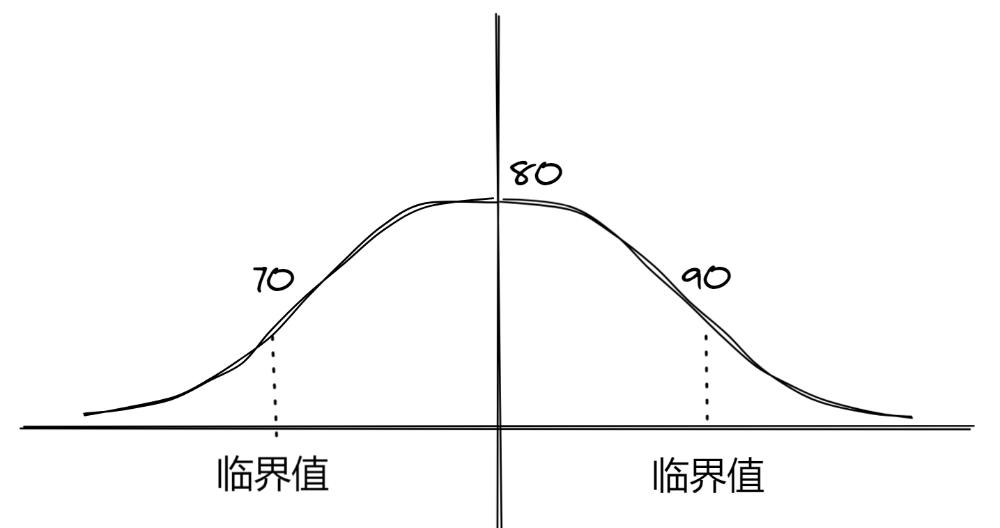
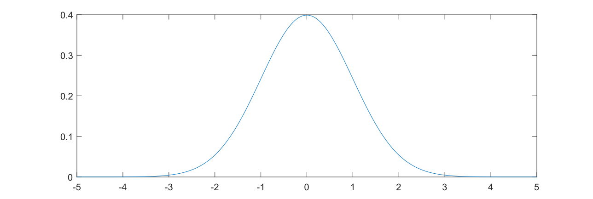
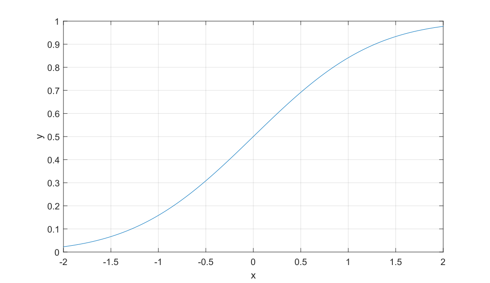

# 假设性检验

## 引例

假设我们是一名补习班老师，所任课的班级内共 $30$ 名同学，我们所教的科目设为 $A$

我们在此提出假设：班上的同学 $A$ 科目的平均成绩在 $80$ 左右，**称为「原假设」**

加入成绩服从**正态分布**，其图像大致为：



---

为了更好的说明这个实例，我们在此给出一些概念：

**显著性水平：**

​	符号定义为 $\alpha$；**拒绝原假设的可能性**；犯**第一类错误**（原假设是正确的，我们却认为它错了）的概率；

**置信水平：**

​	$\beta = 1-\alpha$；**相信原假设成立的概率**；一般取值为 $90\%,95\%,99\%$

---

那么我们假设，对于上图的两个临界值范围的对应面积为 $\beta = 95\%,\alpha = 1 - \beta = 5\%$

即，我们有 $5\%$ 的概率**拒绝原假设**，也就是原假设被推翻

### 假设检验简单步骤 Part.1

假设小菁在称体重，她忽然发现自己居然有 $108$ 斤，之前称量的结果都是 $104$ 斤

假设小菁想要检验：这个月体重是否仍为 $104$ 斤，则通过以下步骤进行：

#### ST.1 确定原假设和备择假设

**原假设我们设为 $H_0$**，**备择假设我们设为 $H_1$**

**Tips：**备择假设一般是原假设的**对立面**

因为小菁想要检验的是体重是否为 $104$，即**「和 $104$ 有无显著差异」**，那么令本月称量结果为 $W$，我们可以得到：
$$
H_0: W = 104 \\
H_1:W\ne 104 \Rightarrow\left\{\begin{array}{l}
w>104 \\
w<104
\end{array}\right.
$$
 ^ 上面的检验为**「双侧检验」**；如果题设改为：小菁想检验自己的体重是否显著大于 $104$，那么显然就会变成一个**「单侧检验」**

#### ST.2 根据要检验量构造分布

**常用分布：**

- 标准正态分布
- $t$ 分布
- $F$ 分布
- $x^2$ 分布

 ^ 上面的后三种分布和标准正态分布大同小异

假设需要**选用正态分布：**

​	在 $H_0$ 成立的条件下，构造 $W\sim N(\mu, \sigma^2)$

然后**将其标准化：**
$$
Z ::= \frac{W-\mu}{\sigma} \sim N(0, 1)
$$
在此需要申明一个概念

**统计量：**

​	上式中 $Z$ 就是统计量，它**只包含 $W$ 一个未知量**

---

回归本例，假设小菁选择正态分布，则其流程为：

在 $H_0 = 90$ 的条件下：
$$
W\sim N(104, 4)\\
Z ::= \frac{W - 104}{2} \sim N(0, 1)
$$

#### ST.3 绘制概率密度图



 ^ 标准正态分布

上图绘制代码：

```matlab
x = -5:0.001:5;
plot(x, normpdf(x, 0, 1))
```

#### ST.4 给出置信水平

一般置信水平 $\beta = 95\%$ 是使用最多的，故在此也取 $\beta = 95\%$

则 $Z$ 有 $95\%$ 的概率位于区间 $[-1.96, 1.96]$

即，当小菁的当前体重 $W$，满足 $Z\in[-1.96, 1.96]$，则小菁**有 $95\%$ 的概率认为自己的体重和 $104$ 没有显著差异**

**Tips：**

​	这里的 $1.96$ 是如何计算出来的，上图的曲线的函数表达式是什么，后文会解答

## 概率密度函数 PDF

概率密度函数，简称 PDF（Probability Density Function）

---

先来了解一下随机变量的分类

### 离散型随机变量

|   X   |  1   |  2   |  3   |
| :---: | :--: | :--: | :--: |
| **P** | 0.1  | 0.2  | 0.7  |

### 连续型随机变量

设 $X$ 分布于 $[a, b]$ 之间，则 $f(x)$ 满足：
$$
P(a\leq X \leq b) = \int^b_af(x)dx = 1,f(x) \geq 0
$$
则 $f(x)$ 就是 `PDF（概率密度函数）`

其中 $f(X_0)$ 表示的意义为**「$X_0$ 时的概率强度」**

### 标准正态分布

对于 $X\sim N(0, 1)$，其 PDF 定义为 $f(x)$，则
$$
f(x) = \frac{1}{\sqrt{2\pi}}e^{-\frac{x^2}{2}}
$$
 ^ 显然是一个**偶函数**

那么对于 $\beta = 95\% = 0.95$，其中的 $1.96$ 的来源为：
$$
\int_{-1.96}^{1.96} \frac{e^{\frac{-x^{2}}{2}}}{\sqrt{2 \pi}} d x=0.950004 \approx 0.95
$$
 ^ 上式仅验算，具体如何逆运算推导出 $1.96$，还需了解`累积密度函数`

#### 累积密度函数

累积密度函数，简称 CDF（Cumulative Density Function）

---

假设 $X$ 服从概率密度函数 $f(x)$ 的分布，即 $X\sim f(x)$，则：
$$
F(x) = P(X \le x) = \int_{-\infty} ^ xf(x)dx
$$
 ^ $F(x)$ 可以理解为 $X \le x$ 的概率，也就是在 $[-\infty, x]$ 上的 $f(x)$ 的积分

我们将其函数绘制出来：



 ^ $X\sim N(0, 1),F(x)$ 的图像 

**性质：**
$$
\left\{\begin{array}{l}
F(-\infty) = 0 \\
F(+\infty) = 1 \\
F(x) \uparrow \\
F'(x) = f(x)
\end{array}\right.
$$

---

那么我们接下来计算 $1.96$ 是怎么来的：

因为 $[-1.96, 1.96]$ 内的面积值为 $0.95$，故范围之外的面积值为 $1 - 0.95 = 0.05$，那么根据**对称性**，可以得到一边的面积为 $0.025$

即 $F(x) = \int_{-\infty} ^ {x}f(x)dx = 0.975 $，即我们所要求的 $x_0$ 为
$$
x_0 = F^{-1}(0.975)
$$
 ^ $F^{-1}(x)$ 为 $F(x)$ 的**反函数**，MATLAB 中对应的函数为 `norminv`

```matlab
norminv(0.975, 0, 1)
```

```
ans =
    1.9600
```

同理，我们也可以计算 $90\%,95\%,99\%$ 对应的值：

```matlab
x = [0.9 0.95 0.99]
norminv(x + (1 - x) / 2, 0, 1)
```

```
ans =
	1.6449    1.9600    2.5758
```

## 假设检验简单步骤 Part.2

那么真实情况为，小菁的体重 $W = 108$，那么
$$
Z^* = \frac{108 - 104}{2} = 2 \\
Z^* > 1.96 \Rightarrow H_0有问题
$$
故我们可以判定：小概率事件发生，$H_0$ **原假设不成立**，故小菁的体重和 $104$ 有显著差异

---

**拒绝域：**

​	具体定义不解释，但很好理解，本例中拒绝域为：$[-\infty,-1.96]\cup[1.96, +\infty]$

**接受域：**

​	具体定义不解释，但很好理解，本例中接受域为：$[-1.96, 1.96]$

**Tips：**

​	如果是单侧检验，假设小菁体重是不是远大于 $104$，那么其接受域为 $[-\infty, 1.96]$；拒绝域为 $[1.96, +\infty]$

---

当**置信水平** $\beta = 99\%$ 时，$Z^* = 2 < 2.5758$，故 $H_0$ **原假设成立**

### 另一种角度的理解

如何彻底理解 $\beta$ 置信水平呢？

- 假设小菁觉得自己没胖，**十分相信**「我的体重就是 $104$ 附近」，那么 $\beta = 99\%$ 时，得到的结果为 $H_0$ 假设成立，小菁如愿以偿
- 假设小菁觉得自己确实胖了点，**不是十分相信**，那么 $\beta = 0.95$，得到的结果为 $H_0$ 假设不成立，确实胖了

所以，置信水平就是**「相信原假设的程度」**

## 计算技巧

我们除了计算 $Z^*$，还可以计算 $P$ 值
$$
Z^* = 2 \\
P(X \le 2) = F(2) = 0.9772 \\
P(X \ge 2) = 1 - F(2) = 0.0228 = P
$$
那么可由检验类型分为下面两种情况讨论：

- **单侧检验**：$P = 0.0228 < 0.05$，在 $\beta = 95\%$ 时，**拒绝 $H_0$**
- **双侧检验**：$P = 0.0228 > 0.05\times2 = 0.1$，在 $\beta = 95\%$ 时，**无法拒绝 $H_0$**

**Note：**

​	双侧检验的 $P$ 值是单侧检验的**两倍**
