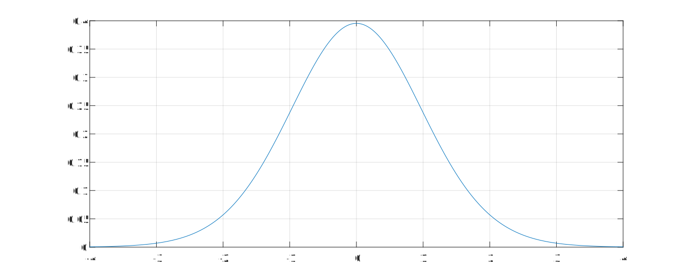

# 皮尔逊相关系数假设检验

- 书接上文《5.1-皮尔逊相关系数》

## 对皮尔逊相关系数进行假设检验

在此继续 `5.2-假设性检验#引例` 中的补习班例子，共 $30$ 名同学

### ST.1 提出假设

​	提出**原假设 $H_0$** 和**备择假设 $H_1$**（两个假设**截然相反**，即 $H_0 \cup H_1 = U,U$ 是**全集**） 

如果我们计算出了一个皮尔逊相关系数 $r$，我们想**检验其是否显著异于 $0$**，我们可以按照如下设定原假设和备择假设：
$$
H_0: r = 0 \\
H_1:r \neq0
$$
我们选取置信水平 $\beta = 95\%$ 

^ 这是一个**双侧检验**

### ST.2 构造某一分布统计量

​	在原假设成立的条件下，我们要利用**要检验的量**，构造出一个符合某一分布的**统计量**

 ^ 均在 《5.2-假设性检验》中有提到；**统计量**为要检验量的一个函数，里面不能有其他变量；**分布**一般有「标准正态分布、$t$ 分布、$x^2$ 分布、$F$ 分布」四种

---

对于皮尔逊相关系数 $r$ 而言，在满足`一定条件`下，我们可以构造统计量：
$$
t = r\sqrt{\frac{n - 2}{1 - r^2}}
$$
可以证明 $t$ 是服从**自由度为 $n - 2$ 的 $t$ 分布**，在此 $n = 30$

 ^ `一定条件`下文会提到；上式证明很复杂，不做深入研究

### ST.3  带入验证

假设我们现在计算出来的相关系数 $r = 0.5,n = 30$，则容易得到**检验值 $t^*$**：
$$
t^* = 0.5\sqrt{\frac{30 - 2}{1 - 0.5^2}} = 3.05505
$$

### ST.4 判断结论

首先我们通过 MATLAB 绘制出来 $t$ 分布的概率密度函数图像：

```matlab
n = 30;
x = -4:0.0001:4;
y = tpdf(x, n - 2);
plot(x, y)
grid on;
```



那么经过查询 [t 分布表](http://81.68.160.116:10001/a/77/)，我们可以确定，此**双侧检验**的置信区间为 $[-2.0484, 2.0484]$，我们绘制出其**接受域**，**拒绝域图像**：

```matlab
n = 30;
x = -4:0.0001:4;
y = tpdf(x, n - 2);
plot(x, y, '-')
grid on;
hold on;

idx=x>=-4&x<=-2.0484;
xi=x(idx); yi=y(idx);
fill([xi xi(end) xi(1)],[y(idx) 0 0],'m','facealpha',.2,'edgecolor','r')

idx=x>=2.0484&x<=4;
xi=x(idx); yi=y(idx);
fill([xi xi(end) xi(1)],[y(idx) 0 0],'m','facealpha',.2,'edgecolor','r')

idx=x>=-2.0484&x<=2.0484;
xi=x(idx); yi=y(idx);
fill([xi xi(end) xi(1)],[y(idx) 0 0],'b','facealpha',.2,'edgecolor','r')
```


那么根据图像和我们的分析目标，可以得到：
$$
t^* =3.05505 > 2.0484 \Rightarrow H_0 不成立
$$
所以，**在 $95\%$ 的置信水平上，我们拒绝原假设 $H_0:r = 0$，因此 $r$ 是显著不为 $0$ 的**

---

同理，我们使用 **$P$ 值判断法**
$$
P= \text{tcdf}(3.05505, n -2 = 28) \times2 = 0.0049
$$
 ^ 其中， tcdf 为 $t$ 分布的`累积密度函数`；因为是双侧检验，所以要 $\times2$

则我们直接查表，对于 $95\%$ 的置信水平：

- $P< 0.05$ 拒绝原假设
- $P> 0.05$ 无法拒绝原假设

故在此 $P = 0.0049 < 0.05$，所以**拒绝原假设**

### 显著性标记

我们对三大常用 $\beta$ 置信水平进行归纳，设 $P$ 值为一常数 $c$，并规定如下：

- $P < 0.01$，说明在 $99\%$ 的置信水平上拒绝原假设，记 $P = c^{*}$
- $P < 0.05$，说明在 $95\%$ 的置信水平上拒绝原假设，记 $P = c^{**}$
- $P < 0.10$，说明在 $90\%$ 的置信水平上拒绝原假设，记 $P = c^{***}$

上面的这种带有星号的记法便是「显著性标记」

### P 值判断法补充

对于一组数据，求解其 $P$ 值，直接通过下列代码即可求出 $R,P$ 两值：

```matlab
clear;clc
% 加载体测数据
load 'physical fitness test.mat' 
% 求解 R P
[R, P] = corrcoef(Test)
```

**得到的 R：**

| 1.0000  | 0.0665  | -0.2177 | -0.1920 | 0.0440  | 0.0951  |
| :-----: | :-----: | :-----: | :-----: | :-----: | :-----: |
| 0.0665  | 1.0000  | 0.0954  | 0.0685  | 0.0279  | -0.0161 |
| -0.2177 | 0.0954  | 1.0000  | 0.2898  | 0.0248  | -0.0749 |
| -0.1920 | 0.0685  | 0.2898  | 1.0000  | -0.0587 | -0.0019 |
| 0.0440  | 0.0279  | 0.0248  | -0.0587 | 1.0000  | -0.0174 |
| 0.0951  | -0.0161 | -0.0749 | -0.0019 | -0.0174 | 1.0000  |

**得到的 P：**

| 1.0000 | 0.1061 | 0.0000 | 0.0000 | 0.2859 | 0.0208 |
| :----: | :----: | :----: | :----: | :----: | :----: |
| 0.1061 | 1.0000 | 0.0204 | 0.0960 | 0.4978 | 0.6963 |
| 0.0000 | 0.0204 | 1.0000 | 0.0000 | 0.5469 | 0.0687 |
| 0.0000 | 0.0960 | 0.0000 | 1.0000 | 0.1542 | 0.9637 |
| 0.2859 | 0.4978 | 0.5469 | 0.1542 | 1.0000 | 0.6728 |
| 0.0208 | 0.6963 | 0.0687 | 0.9637 | 0.6728 | 1.0000 |

#### 如何添加显著性标记

##### 使用 Excel 添加

添加显著性标记是一个非常繁琐的过程，在此提供一种笔者自己研究出来的 Excel 添加显著性标记的方法，可以简化很多人工操作

将我们要处理的 $P$ 值表格导入到 Excel 中的 $A1$ 单元格起始，如图：


首先添加**三颗星显著性标记：**

​	在 $A8$ 单元格键入：

```excel
=IF(A1<0.01, CONCAT(ROUND(A1, 4),"***"), ROUND(A1, 4))
```

​	然后使用自动填充，得到如下表格：


再添加**两颗星显著性标记：**

​	在 $A15$ 单元格键入：

```excel
=IF( AND(A8 > 0.01, A8 < 0.05, ISNUMBER(A8)),CONCAT( ROUND(A8, 4), "**"), IF(ISNUMBER(A8), ROUND(A8, 4), A8))
```

​	然后使用自动填充，得到如下表格：


最后添加**一颗星显著性标记：**

​	在 $A22$ 单元格键入：

```excel
=IF( AND(A15 > 0.05, A15 < 0.1, ISNUMBER(A15)),CONCAT( ROUND(A15, 4), "*"), IF(ISNUMBER(A15), ROUND(A15, 4), A15))
```

​	然后使用自动填充，得到如下表格：


至此，自动添加完毕，可以导入到论文中使用辣！（这个方法笔者折腾了挺长时间

|    1     |  0.1061  |   0***   |  0***  | 0.2859 | 0.0208** |
| :------: | :------: | :------: | :----: | :----: | :------: |
|  0.1061  |    1     | 0.0204** | 0.096* | 0.4978 |  0.6963  |
|   0***   | 0.0204** |    1     |  0***  | 0.5469 | 0.0687*  |
|   0***   |  0.096*  |   0***   |   1    | 0.1542 |  0.9637  |
|  0.2859  |  0.4978  |  0.5469  | 0.1542 |   1    |  0.6728  |
| 0.0208** |  0.6963  | 0.0687*  | 0.9637 | 0.6728 |    1     |

##### 使用 SPSS 添加

选择 `分析——相关——双变量`


全选我们想要求解的指标


 ^ **双尾**就是双侧检验，**单尾**就是单侧检验；勾选**标记显著性相关性**就可以自动添加星号

点击**确定：**


可以看到，**SPSS 只能标记两颗星星**，且两颗行星的定义也和我们上面的定义有所不同

### 皮尔逊相关系数假设检验的条件

- 实验数据通常假设是成对的**来自于正态分布的总体**
  - 因为我们在求皮尔逊相关性系数后，通常还会使用 $t$ 检验之类的方法来进行皮尔逊相关性系数的检验（上文），而 $t$ 检验是基于数据呈正态分布而假设的
- 数据**差异不能太大（异常值）**
- **每组样本之间是独立抽样的**
  - 构造 $t$ 统计量的时候需要使用到

重点就在上面的第一个条件：**如何验证数据是否为正态分布？**

下一篇笔记会讲~