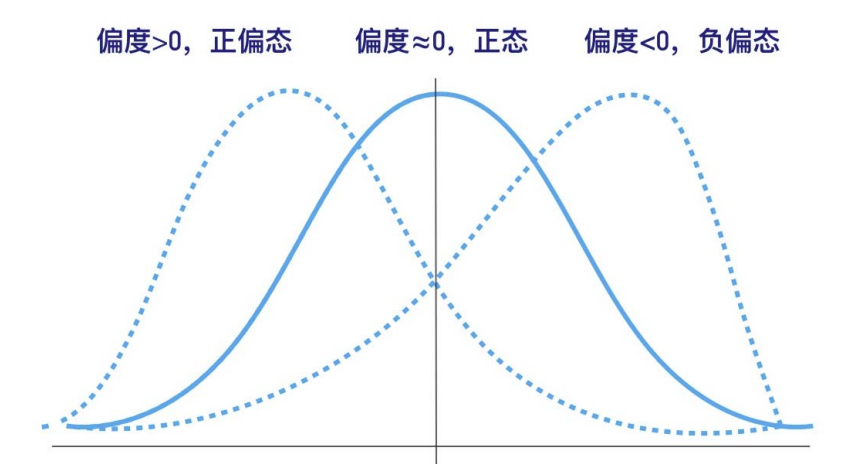
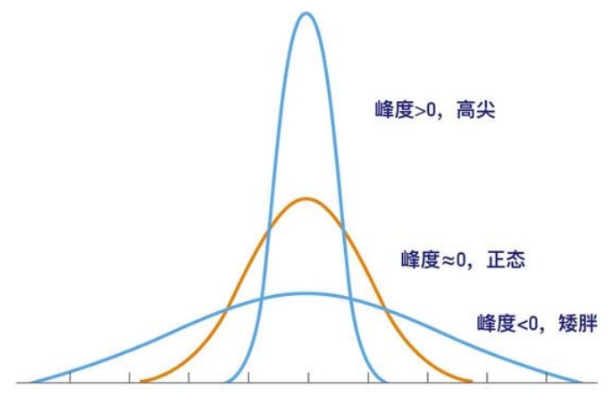
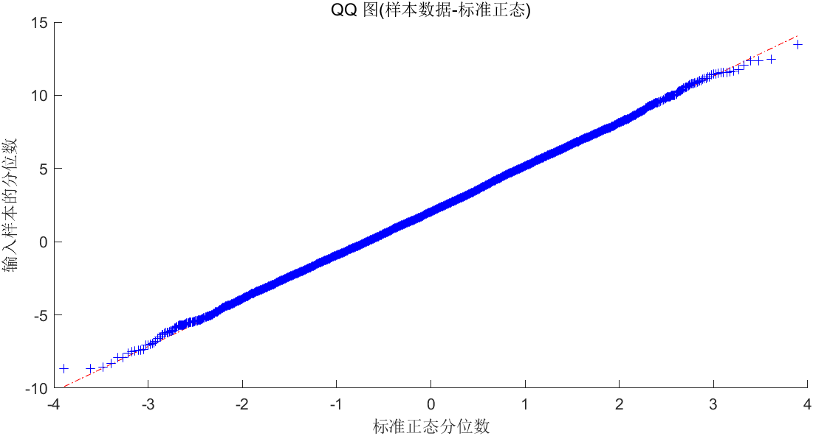
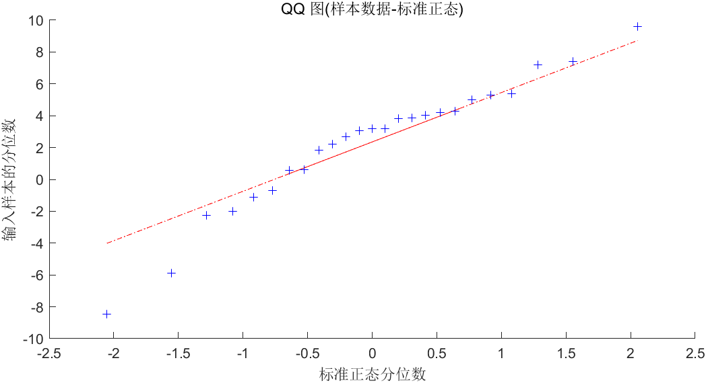

# 对数据进行正态分布检验

## 雅克-贝拉检验（Jarque-Bera Test）

- 此检验要求样本量 $n \ge 30$

---

对于一个随机变量 $\{X_i\}$，假设其偏度为 $S$，峰度为 $K$，那么我们可以构造 *JB 统计量*：
$$
JB = \frac{n}{6}[S^2 + \frac{(K - 3)^2}4]
$$
 ^ **Tips：**正态分布的偏度为 $0$，峰度为 $3$

可以证明，如果 $\{X_i\}$ 是正态分布，那么在**大样本情况下** $JB\sim \chi^2(2)$（自由度为 $2$ 的[卡方分布](https://baike.baidu.com/item/%E5%8D%A1%E6%96%B9%E5%88%86%E5%B8%83/2714796)）

### 假设检验步骤

**设：**

- **原假设** $H_0$：该随机变量**服从**正态分布
- **备择假设** $H_1$：该随机变量**不服从**正态分布

然后计算该变量的**偏度**和**峰度**，得到**检验值 $JB^*$**，并计算出其对应的 **$P$ 值**

将 $P$ 值与 $0.05$ 比较，如果小于 $0.05$ 则可能拒绝原假设，否则我们不能拒绝原假设

#### 补充：偏度和峰度

##### 偏度：

**定义：**
$$
E\left[\left(\frac{X-u}{\sigma}\right)^{3}\right]
$$
**图像：**



##### 峰度

**定义：**
$$
\left[\left(\frac{X-u}{\sigma}\right)^{4}\right] \text { 或 } E\left[\left(\frac{X-u}{\sigma}\right)^{4}\right]-3
$$
**图像：**



##### 代码实现

```matlab
x = normrnd(2, 3, 100, 1)
% 👆生成 100*1 的随机向量，每个元素是均值为 2，标准差为 3 的的正态分布
skewness(x) % 偏度
kurtosis(x) % 峰度
```

### MATLAB 检验结果

在 MATLAB 种进行 $JB$ 检验的函数为：

`[h, p] = jbtest(x, alpha)`

^ 其中 $h$ 为拒绝/接受状态，当 $h = 1$ 时，表示**拒绝原假设**；$h = 0$ 时，表示**不能拒绝原假设** ；$p$ 为 $P$ 值；alpha 为**显著性水平**，一般取 $0.05$，此时置信水平为 $1  - 0.05 = 0.95$；$x$ 是**要进行检验的随机变量**，且**只能是向量**

```matlab
load 'physical fitness test.mat' % 加载 Test 变量，作为女生体测数据
size(Test); % 519    6

% 通过循环进行 JB 检验
% 先获取列数
r_num = size(Test, 2); % 6，因为获取的是 519 6 的第二个数字
% 创建 H，P 数组保存数据
H = zeros(1, r_num);
P = zeros(1, r_num);
% 进行循环
for i = 1 : r_num
    [h, p] = jbtest(Test(:, i), 0.05);
    H(i) = h;
    P(i) = p;
end
disp(H)
disp(P)
```

```matlab
     1     1     1     1     1     1

    0.0110    0.0010    0.0136    0.0010    0.0010    0.0393
```

可以发现，全都拒绝原假设，即我们有 $95\%$ 的信心认为此数据不是正态分布

## 夏皮洛-威尔克检验（Shapiro-wilk Test）

- 与 $JB$ 检验不同的是，本检验适用于小样本检验，即数据量 $3\le n\le50$

---

同上 $JB$ 检验，我们在此**设：**

- **原假设** $H_0$：该随机变量**服从**正态分布
- **备择假设** $H_1$：该随机变量**不服从**正态分布

计算出威尔克统计量之后，得到相应的 **$P$ 值**，然后与 $0.05$ **显著性水平**比较，得到最终结果

**Tips：**MATLAB不能直接计算这个检验，所以在此使用 SPSS 26 进行操作

---

选择 `分析——描述统计——探索`：


将变量添加到右边，并点击 `图`：


在对话框中勾选 `含检验的正泰图`：


点击 `继续——确定`，得到如下**结果：**


可以直接看到 `夏皮洛-威尔克检验 `的值

## Q-Q 图

在统计学中， **Q-Q 图（Q 代表分位数 Quantile）是一种通过比较两个概率分布的分位数对这两个概率分布进行比较的概率图方法**

首先选定分位数的对应**概率区间集合**，在此概率区间上，点 $(x, y)$ 对应于第一个分布的第一个分位数 $x$ 和第二个分布在与 $x$ **相同概率区间上**的相同的分位数

这里，我们选择正太分布和要检验的随机变量，对其作出 Q-Q 图，则显然，如果**要检验的随机变量完全符合正态分布，则其图线为一条直线**

所以我们得到：

- 要**利用 Q-Q 图鉴别样本数据是否近乎于正态分布**，只需看 Q-Q 图上的点是否近似的**在一条直线附近**

---

### Q-Q 图的绘制

在 MATLAB 中，直接使用 `qqplot` 进行绘制即可

```matlab
% 自己生成的数据进行绘制
x = normrnd(2, 3, 10000, 1);
qqplot(x)
```



#### 一些问题

请看如下小样本时的 Q-Q 图绘制情况：

```matlab
% 自己生成的数据进行绘制，样本数为 25
x = normrnd(2, 3, 25, 1);
qqplot(x)
```




 ^ 可以看到，**效果并不好**

所以在**样本量较少的时候，不建议使用 Q-Q 图**

## 总结

在实际使用过程中，我们**优先选择两种检验**，Q-Q 图看情况选择，如果拟合出的直线效果非常好，则可以考虑放入论文中进行使用