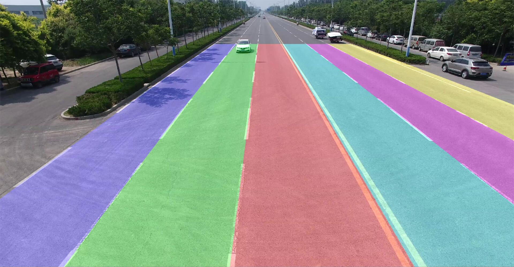
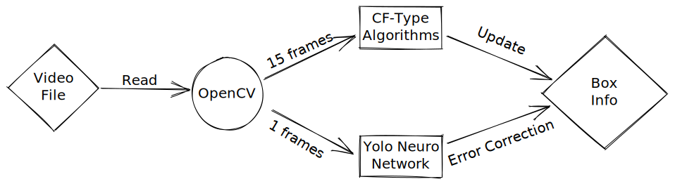
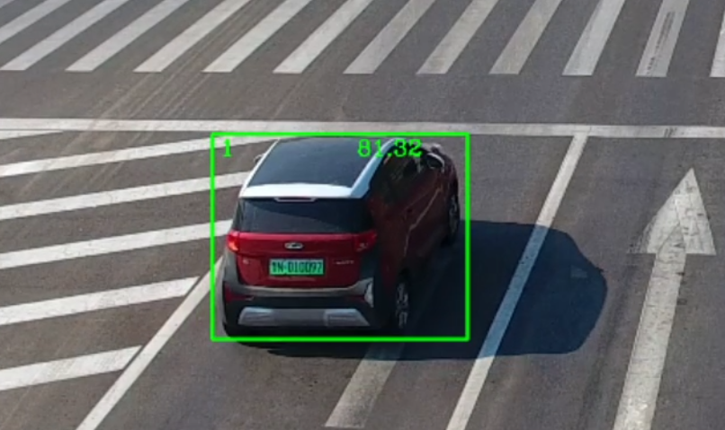

# A01项目汇报
时间：2021/1/19

## 成果

##### 目标检测部分

deep sort

- 效果视频：OpenCV + Yolov4

  <video src="../../../../../服创A01项目/成果视频/2022-01-19 OPENCV Yolov4检测效果.mp4"></video>

- 效果视频：OpenCV + CF类算法

  <video src="../../../../../服创A01项目/成果视频/2022-01-17OPENCV CF类检测效果.mp4"></video>

###### 	说明：

- **OpenCV + Yolov4 方案**采用的是 OpenCV 内置模型加载器，直接将训练好的 Yolov4 模型（此处使用`yolov4-csp-swish`）加载进 OpenCV ，给网络传入通过 OpenCV 得到的视频帧，再将结果显示出来
- 此种方式效率较慢，OpenCV 使用GPU加速较为麻烦


- **OpenCV + CF类算法**采用的是 OpenCV 内置的一系列`CF 类算法`，如下所示：

  ```python
  # OPENCV 已经实现了一些追踪算法
  OPENCV_OBJECT_TRACKERS = {
      "csrt": cv2.legacy.TrackerCSRT_create,
      "kcf": cv2.legacy.TrackerKCF_create,
      "boosting": cv2.legacy.TrackerBoosting_create,
      "mil":cv2.legacy.TrackerMIL_create,
      "tld":cv2.legacy_TrackerTLD.create,
      "medianflow": cv2.legacy.TrackerMedianFlow_create,
      "mosse": cv2.legacy.TrackerMOSSE_create
  }
  ```

  再通过 OpenCV 的 `多物体 Tracker`进行目标的追踪

- 此种方法效率高，准确度也有保证，但是存在一些弊端：

  - 需要人为手动划定框
  - 框的大小不会改变，直到跟丢

##### 车道线检测部分




## 问题与解决方案

##### 目标检测

- 深度学习模型效率慢，实时性差

  - 方案一：此处使用的 Yolov4 是一个 82 分类检测模型，更多分类检测会造成推理速度变慢

    故使用自己训练的 Yolo 模型代替此处的，可能会加速推理获得更好的效果

    - 此方案值得尝试，吴蜀魏学长正在训练相关 Yolo 模型

  - 方案二：将上述两种方案进行结合，通过 OpenCV 读取视频时进行控制，将**大多数帧**通过 CF 类算法进行目标检测，**极少数帧**使用深度学习模型穿插其中，使用深度学习**标定初始追踪框**，同时用来**纠正 CF 类算法框大小不改变**的问题

    - 此方案也值得尝试，效果可能会很不错

  - 理想情况下的模型应当是：

    

  - 比较硬核的方案：OpenCV 封装成为输出程序，并不直接参与视频帧的渲染，而是通过**前端渲染**的方式进行，加速处理效率，这样也可能可以使用**多线程**等技术，实现实时渲染

- 逆行检测相关

  - 问题：标定行驶方向后，OpenCV 通过两帧之间的 Box 轮廓中心点位置是可以判断出来车辆的行驶方向的

    但是可能会在十字路口，或其他意料之外的情况下造成逆行误判（转弯的时候中心位置）

  - 方案：为了消除上述的误判，也可以使用 Yolo 模型进行车辆的姿态检测，已经有相关工作了，将车辆姿态朝向加入逆行检测的判定条件可以消除大部分误判

- 压线检测想相关

- 旋转检测框

  - 问题：压线检测，既不能通过 Yolo 标定的 Box 框进行检测，也不能通过 Box 中心位置进行检测，这显然会造成判定过严和判定过松

  - 方案：使用分割网络，进行车辆语义分割，当车辆的 Box 边缘接近「已经标定好的车道线」的时候，应用分割网络进行语义分割，返回一张车辆轮廓的二值图像，再使用 OpenCV 自带的效率较高的边缘提取器提取轮廓信息，和车道线进行碰撞检测即可

    - 此方案的不足：如下图所示的情况，即使是分割也难以解决：

      

    …实在想不出其他的办法pwq，感觉这个判定好难

- 不同车辆之间判别相关
  - 问题：上述所有判定可行的前提为：每一辆在画面中的车都要有一个自己的 ID ，这样才好统一制定逻辑，但此处使用的网络并没有返回 ID 信息
  - 方案：修改 Yolo 网络，使网络返回每个目标的特殊 ID 信息（已经有相关工作）

##### 车道线检测

目前已知的问题是道路中有车辆时，道路检测结果会偏向车辆


汇报完毕，谢谢大家！

希望大家有什么好的想法都提出来，共同进步
