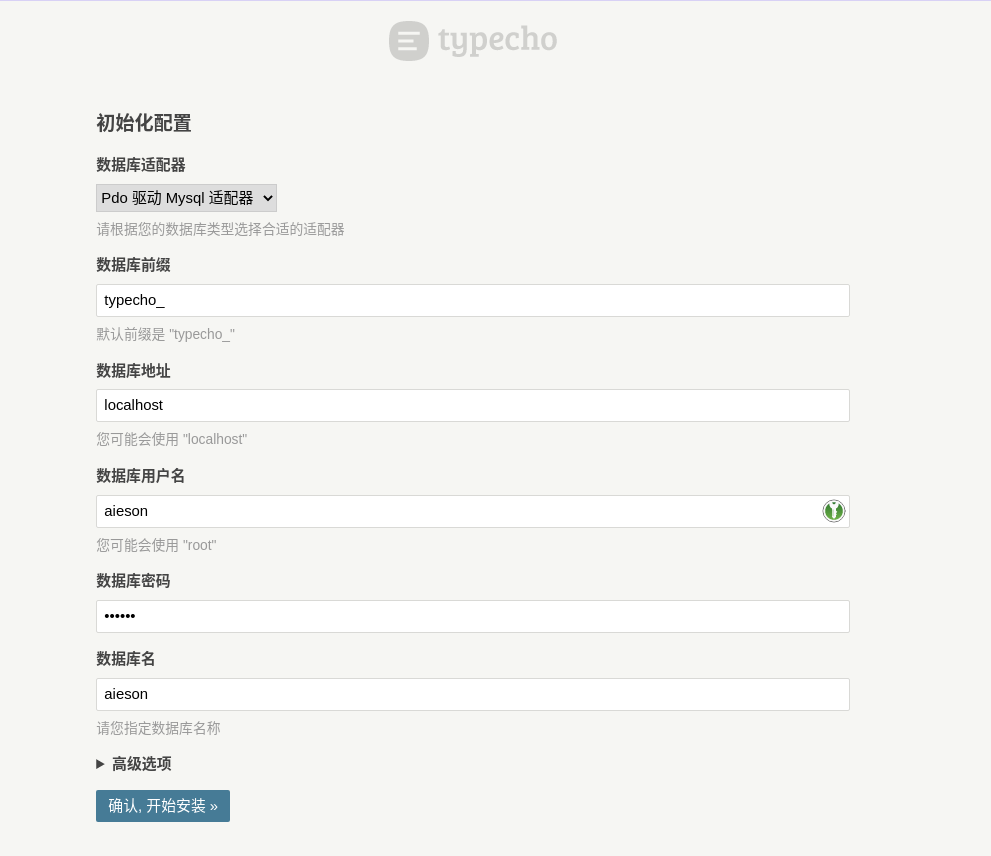

# 服务器折腾记录


[Test](obsidian://open?vault=Notes&file=%E8%A7%86%E5%90%AC%E8%AF%B4%E8%80%83%E8%AF%95%E8%AE%AD%E7%BB%83)

## Background

因在2021年12月23日看到腾讯云活动，花51元入手了一个「轻量应用服务器」。配置如下：

- 上海四区国内服务器
- 核心数：2
- 内存：4GB
- 磁盘：80GB SSD
- 带宽：8 Mbps
- 操作系统：Ubuntu 20.04
- 其他：BT Panel

因为此前从来没有写过类似的折腾记录，所以很久之前折腾的东西再次使用的时候就不太会用了。所以从0开始折腾一款服务器的时候，在本文档记录下来。

文档记录软件：[Typora](https://www.typora.io/)

## 各种内置软件配置

### Shell

Shell采用fish：

```shell
sudo apt install fish
```

自身就很好用，故不采用其他多余配置。

### Screen

使用screen进行session管理：

```bash
sudo apt install screen
```

#### 基本命令

列出所有现有screen和状态：

```bash
screen -ls
```

不进入会话，强行关闭某回话：

```bash
screen -X -S session_name quit
```

开启一个新的 Session：

```bash
screen -S session_name
```

在后台开启一个新的 Session：

```bash
screen -dm -S session_name command
```

比如我想启动jupyter-notebook软件包在后台，那么执行：

```bash
screen -dm -S jupyter jupyter-notebook
```

#### 快捷键

- C-a d：最常用的快捷键，暂时退出当前会话，会话内容继续执行不受影响
- C-a S：将窗口水平分割
- C-a |：将窗口竖直分割
- C-a Q：退出

### 宝塔面板

直接前往[宝塔官网](bt.cn)进行安装即可。注意使用root用户执行安装命令。

#### Web服务器环境：

采用LNMP（Linux Nginx MySQL PHP）。一键安装即可，在此版本采用PHP7.4。

## Web服务搭建

### Typecho

因为npy学习Java的时候，教程推荐搭建Typecho作为个人blog的环境，所以搭建一个Typecho作为示范。

#### 获取源代码

前往：[Typecho—GitHub](https://github.com/typecho/typecho)

执行如下命令：

```bash
# 前往网站根目录
cd /www/wwwroot/
# 通过git clone获取Typecho源代码：
git clone https://github.com/typecho/typecho.git
```

前往宝塔面板进行新建网站，此处选择域名就是本机公网IP，端口为10001，并且新建一个数据库。


之后访问`IP:10001/install.php`即可进入安装界面。


提示「上传目录无法写入, 请手动将安装目录下的 /usr/uploads 目录的权限设置为可写然后继续升级」，进入宝塔文件管理，将Typecho的文件夹权限设置为777，拥有者设置为www。


点击安装即可，数据填入刚才创建时的数据：



后续：设置用户名、密码、网站地址默认、邮件地址。

最后进入`IP:10001`即可看到Typecho已经搭建完成！

#### 后续操作

- 本地图片上传失败。
  - 解决方案：把usr/uploads权限修改为777即可

