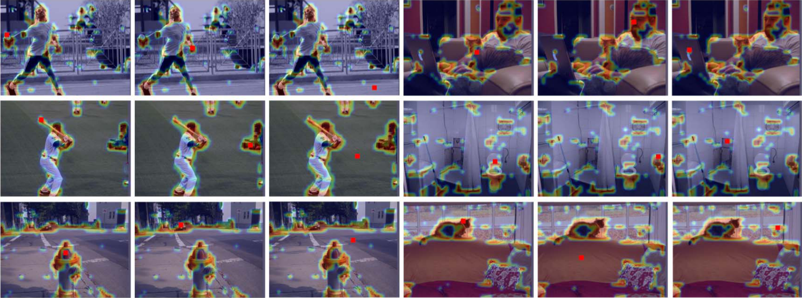
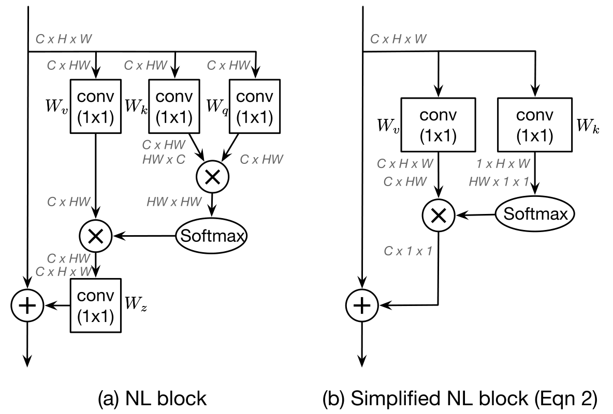

# GCNet

**GCNet:** [PDF：Non-local Networks Meet Squeeze-Excitation Networks and Beyond](http://openaccess.thecvf.com/content_ICCVW_2019/papers/NeurArch/Cao_GCNet_Non-Local_Networks_Meet_Squeeze-Excitation_Networks_and_Beyond_ICCVW_2019_paper.pdf)

## 前置知识补充

### Local & Non-Local

在卷积神经网络中，经常见到的一个词是**「感受野（Receptive Field）」**，而本节所介绍的「Local」和「Non-Local」就是针对感受野来说的[1]

而对于卷积来说，它的感受野其实就是**卷积核的大小**，一般我们选用 $3\times3$、$5\times5$ 的之类的卷积核，卷积操作只考虑局部范围内的相邻区域。因此，他们全都是**Local 运算**；同理，**池化（Pooling）**也是 Local 的

我们之前接触过什么 Non-Local 操作吗？还真有！答案就是「全连接」。全连接不仅是 Non-Local 的，甚至还是 Global 的。但是如果之前读过 AlexNet[2] 论文的话，就可以知道，卷积神经网络被发明出来的初衷就是解决全连接问题的超大**参数量**，使得图片变得可以训练

我们知道，通过堆叠卷积层，可以增大其感受野，但如果看特定层的卷积核在原图上的感受野，它不管如何堆叠，作用是有限的

然而有一些任务，需要更多原图上的信息，为了解决这个问题，已经有很多工作被提出来了，比如：Attention

Attention 可以通过某一些操作，在某些层引入全局信息，就能很好的解决感受野看不清全局的情况，为后面的运算带来更丰富的语义信息

所以我们可以总结为：**Attention 是 Local 方法向 Non-Local 方法优化的手段之一**

## 论文

### Abstract

- 通过 `NLNet（Non-Local Network）` 改进而来
- 作者发现，对于一张图片，不同的 `Query Positions` 通过 Non-Local 结构获得的全局上下文信息**几乎一样**
- 针对上面的问题，作者提出一个更加轻量级的模块 GC（Global Context）Block
- **更加轻量**的同时，outperform 了原来的 NLNet
- 可以用在 `检测、分割、分类、识别` 等领域

### Introduction

- 简化 NL Block，并将其与 SE Block 统一起来：
  - 建立一个上下文建模模块，将所有位置的信息聚集在一起，获取全局上下文特征
  - 特征转换模块，用于捕获 Channel 信息的相互依赖关系
  - 融合模块，将全局上下文特征合并为所有位置的特征
- 主要贡献总结：
  - 通过独立 Query 的观测方法，对 Non-Local Net 有了全新的认识
  - 提出的总体框架，有效的解释了深度神经网络构建模块之间的**内在联系**，可以指导后续新方法的发明
  - 具体在网络的实现上，GCNet 简单实用，参数量小

^ 不同 Query-position 的 Attention 热力图可视化，可以发现确实**几乎没有区别**

### Analysis on Non-local Networks

首先回顾 Non-Local Block 的设计，并且为了直观理解本文的改进方向，作者**可视化**了被广泛使用的 `Non-Local Block` 生成的对于不同 `Query Position` 的 `Attention Map（热力图）`，并着手通过计算上述不同 Attention Map 的**距离**来分析模块在网络中的行为

 ^ 高斯嵌入式的 Non-Local Block 及其轻量版本。其中⊗为矩阵乘法，⊕为加法（Boardcast机制，此略）

#### Revisiting the Non-local Block

- 基本 Non-Local Block 是通过**聚合来自其他区域信息**来增强 `Query Position` 的特征的
- 定义 $x = \{x\}^{N_p}_{i = 1}$ 为 Non-Local Block 的输入实例，其中 $N_p$ 为输入特征图的大小（图像为 $H\times W$；视频为$H\times W \times T$），在这里可以理解为**输入矩阵**
- 定义 $z_i = x_i + W_z \sum\limits_{j = 1}^{N_p} \frac{f(x_i, x_j)}{C(x)} ({W_v\cdot x_j})$ 为 Non-Local Block 的对于 $QueryPosition = i$ 的输出实例，其中 $j$ 为 **所有可能的情况**；$f(x_i, x_j)$ 表示对于位置 $i, j$ 之间的**关系**；$C(x)$ 为**正则化因子**；

## References

[1] [Non-local neural networks——知乎](https://zhuanlan.zhihu.com/p/33345791)

[2] Krizhevsky A, Sutskever I, Hinton G E. Imagenet classification with deep convolutional neural networks[J]. Advances in neural information processing systems, 2012, 25: 1097-1105.

