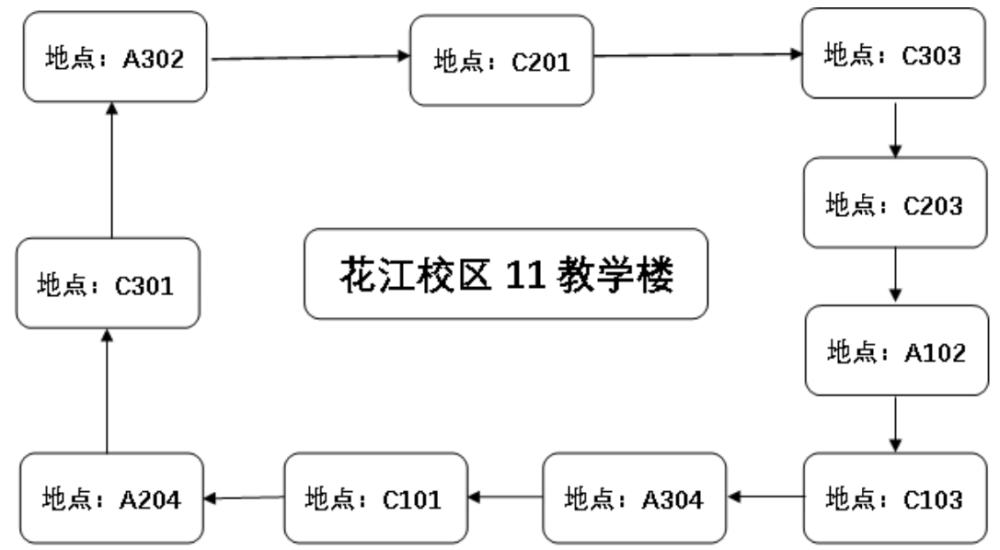
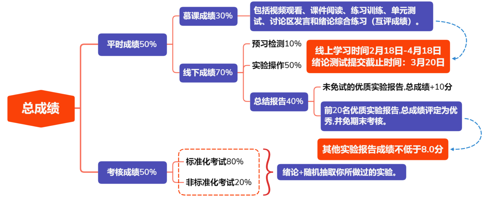
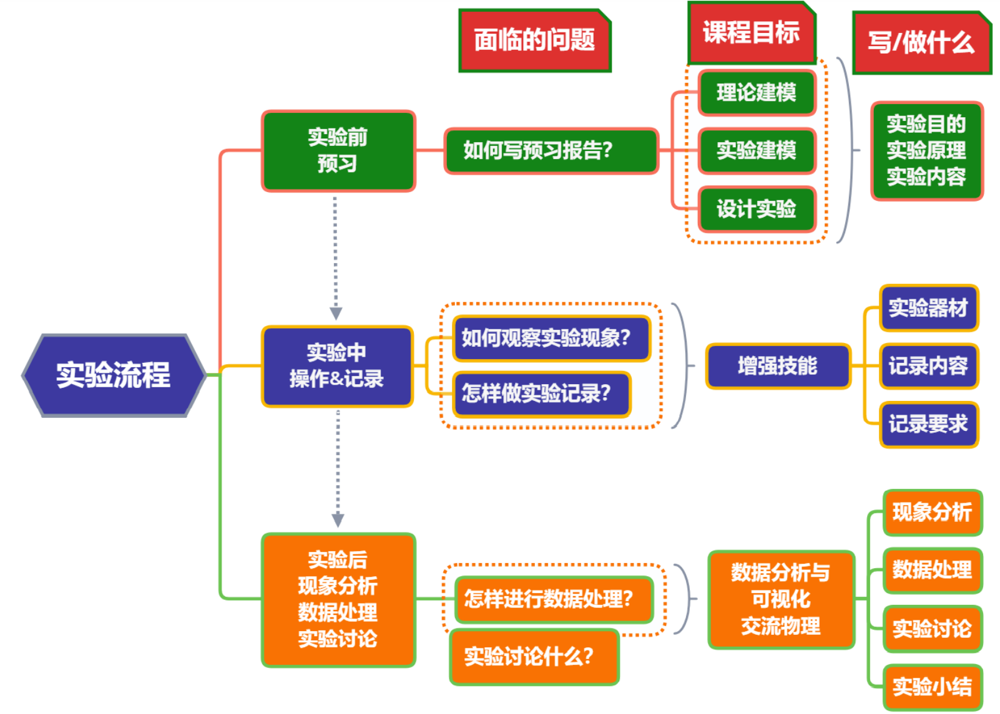
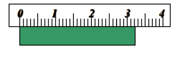
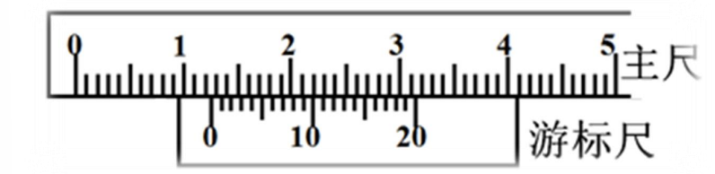

# 大学物理实验 绪论

## 实验&成绩相关问题

- 实验分为春、秋两学期，每学期开设两轮普通实验，学生只需参加其中 一轮实验；根据各学院不同专业要求，可分为5个实验和8个实验两种情况； 

- 每学期每一轮共开设10个实验室，学生根据选课情况按4+5（4周网上预习 +5个规定实验）或4+8 （4周网上预习+8个规定实验）的方式完成线上全部实 验学习和相对应的线下实验。（请查看大学慕课中的开放与关闭时间。）

### 实验室与名称应对关系表

|  组别  |   地点   |              名称              |    教材     |
| :----: | :------: | :----------------------------: | :---------: |
| 第一组 | 11教A304 |     数字示波器的原理与应用     | 实验8 P114  |
| 第二组 | 11教C101 |   三线摆测刚体转动惯量的研究   |  实验3 P87  |
| 第三组 | 11教A204 |        电表的改装与校准        | 实验7 P110  |
| 第四组 | 11教C301 |  非线性电学元件伏安特性的研究  |  实验5 P97  |
| 第五组 | 11教A302 |       分光计的调整与应用       | 实验12 P140 |
| 第六组 | 11教C201 |      直流电桥的原理与应用      | 实验6 P101  |
| 第七组 | 11教C303 |   拉伸法测定金属线的杨氏模量   |  实验2 P82  |
| 第八组 | 11教C203 |  变阻器调节特性与灵敏度的研究  |  实验4 P90  |
| 第九组 | 11教A102 |           声速的测量           | 实验1 P117  |
| 第十组 | 11教C103 | 光路调整和透镜参数的测量与应用 | 实验11 P137 |

### 实验室循环方式

- *实验室与实验名称的应对关系表*（上面）找到第3周第一次实验的上课地点；
- 实验室与实验名称的应对关系表找到第3周第一次实验的上课地点；
- 每次做实验前必须完成下一个实验的预习报告和上一个实验的总结报告。

### 成绩评定

### 物理实验流程图

### 关于优质报告

## 实验数据的获取及评估

### 有效数字

#### 有效数字的取舍

**有效数字：**多位`可靠数字`和一位`可疑数字`的统称叫有效数字

**口诀：**4舍6入5凑偶（<5舍； >5入； =5尾数凑偶）

一些例子：将下列数字全部修约为`四位有效数字`

- $<5,\ 1.118\ 49000 \to 1.118$，因为 $4<5$ 故**舍去**

- $>5,\ 1.118\ 5000000001 \to 1.119$，因为 $5$ **后面不全为 $0$**，故进一位
- $=5, \ 1.117\ 5000\to1.118$，因为 $7$ 为奇数，故**进一位**
- $=5, \ 1.116\ 5000\to1.116$，因为 $6$ 为偶数，故**舍去**

**Tips：**上面 $=5$ 的情况，凑偶原则是**「奇数进 $1$ ，偶数不变」**

#### 有效数字的运算

下面介绍加减法和乘除法的相应的有效数字运算法则

其实综合来看，只需要遵循一条原则即可：**「取小原则」**，请带着这个原则的思考阅读下面的内容

##### 加减法

加减法使用的是 **尾数对齐** 原则

数学描述一下就懂嘞：

​	我们令 $x_1, x_2$ 为两数字，函数 $\phi(x)$ 为取 $x$ 小数点后位数的个数，如 $\phi(0.99) = 2, \phi(0.1) = 1$；

​	那么 $x_1 \pm x_2$ 的结果设为 $X$ ，则 $\phi(X) = \text{min}\{\phi(x_1), \phi(x_2)\}$

---

**例：**

$x_1 = 32.1, x_2 = 3.235$，在尾数对齐的原则下，求 $x_1 + x_2 = ?$
$$
\because \text{min}\{\phi(x_1), \phi(x_2)\} = \text{min}\{1, 3\} = 1 \\  \therefore x_1 + x_2 = 35.335 \approx 35.3
$$

##### 乘除法

乘除法使用的是 **位数对齐** 原则

数学描述一下也懂嘞：

​	我们令 $x_1, x_2$ 为两数字，函数 $\phi(x)$ 为取 $x$ 的数字的个数，如 $\phi(0.99) = 3, \phi(0.1) = 2$；

​	那么 $x_1\times x_2$ 或 $\frac{x_1}{x_2}$ 的结果设为 $X$ ，则 $\phi(X) = \text{min}\{\phi(x_1), \phi(x_2)\}$

---

**例：**

$x_1 = 4.178, x_2 = 10.1$，在位数对齐的原则下，求 $x_1\times x_2 = ?$
$$
\because \text{min}\{\phi(x_1), \phi(x_2)\} = \text{min}\{4, 3\} = 3\\
\therefore x_1\times x_2 =42.1978 \approx 42.2
$$

##### 乘方&开方

乘方&开方使用的是 **长度相等** （我自创的名称）原则

数学描述一下又懂嘞：

​	我们令 $x$ 为一数字，函数 $\phi(x)$ 为取 $x$ 的数字的个数，如 $\phi(7.889) = 4$；

​	那么 $x^n$ 的结果设置为 $X$，则 $\phi(X) = \phi(x)$

---

**例：**

不说废话了，直接给结果：
$$
7.899^2 \approx 62.24 \\
\sqrt{103.45} \approx 10.171
$$

##### 总结表格

| 运算类别  |                           规则描述                           |                             举例                             |
| :-------: | :----------------------------------------------------------: | :----------------------------------------------------------: |
|   加减    |         与参与运算的诸数中末位数字位置最高的一个相同         |                     $278.2+12.451=290.7$                     |
|   乘除    |          与参与运算诸数中有效数字位数最少的那个相同          |                    $5.348\times20.5=110$                     |
| 乘方开方  |              与被乘方、开方数的有效数字位数相同              |                     $\sqrt{200} = 14.1$                      |
|   对数    |  与真数的位数相同（对数的有效数字为**小数点后的全部数字**）  |                      $\log{543}=2.735$                       |
|   指数    |                  与指数中小数点后的位数相同                  |                $𝑒^{9.14} = 9.32 \times 10^3$                 |
| 三角函数  | 将自变量欠准位变化1,运算结果产生差异的最高位就是应保留的有效数字的最后一位 | $\sin {30\degree 2'} = 0.500503748, \sin {30\degree 3'} =0.500755559,$**差异**出现在第 $4$ 位，故 $\sin {30\degree 2'} = 0.5005$ |
| 常数&常量 |    运算中其位数比计算式中其它测量值中有效位最少的多取一位    |                   $4, \pi, \sqrt2, \sqrt3$                   |

#### 有效数字的记录

##### 连续可读仪器

此类仪器**代表有：**米尺、刻度尺、温度计、千分尺

**记录到：**最小分度的下一位，即**估读一位**

**仪器误差：**最小分度值的一半

---

**例：**

分度值位 $1mm$ 的刻度尺，如图所示读数为？

读数：$L = 32.3mm$

仪器误差：$\Delta_仪 = 0.5mm$

##### 定步长仪器

此类仪器**代表有：**游标卡尺、分光计、数显仪器

**记录到：**最小步长量

**仪器误差：**最小分度值

---

**例：**

下图游标卡尺的主尺的最小分度为 $1mm$，游标上有 $20$ 个分度，读数为多少？

最小步长量为：$\frac{1mm}{20} = 0.05mm$

示数为：$12mm + 0.05\times10 mm = 12.50mm$

仪器误差为：$\Delta_仪 = 0.05mm$

 ^ 为什么这里仪器误差是 $0.05mm$ 而不是主尺最小分度值 $1mm$ 呢？

​	因为是「整个仪器的最小分度值」在这里是最小步长量

##### 有等级仪器

此类仪器**代表有：**电流表、电压表

**仪器误差：**$\Delta_仪 = 量程\times 等级\%$

**读数：**$测量量 = \frac{量程}{格子数}\times 指针位置$

注意，仪器误差只能保留一位有效数字，比如 $\Delta_仪 = 量程\times 等级\% = 30mA \times 0.5\% = 0.15mA \approx0.2mA$

###### 什么是等级

电表的等级是用来表示电表的精确度的，我国规定电表分为七个等级，分别为 $0.1,0.2,0.5,1.0,1.5,2.5,5.0$ 级，等级数值越小，说明电表的精确度越高

通常电表的等级都在电表的度盘上标出[^1]

---

**例：**

读取如下图片中电流表所示的读数

$指针位置 = 10.1格$，则 $I = \frac{30}{75}\times 10.1 = 4.04 mA$

通过计算其仪器误差，我们可以得到
$$
\Delta_仪 = 量程\times 等级\% = 30mA \times 0.5\% =0.2mA
$$
所以根据仪器误差，最终结果需要与仪器误差保留同样的有效数字，故最终读数为
$$
I = \frac{30}{75}\times 10.1 = 4.0\  mA
$$

##### 总结表格

|     分类     |                 举例                 |            读数规则             | 仪器误差 $\Delta_仪$ |
| :----------: | :----------------------------------: | :-----------------------------: | :------------------: |
| 连续可读仪器 | 直尺、螺旋测 微仪、物理天 平、温度计 |            估读一位             |    最小分度值一半    |
|  定步长仪器  |       游标类刻度尺， 数显仪表        |         读到最小分度值          |      最小分度值      |
|  有等级仪器  |        指针式电流表、 电压表         | $量程\times等级\%$ 限定读数位数 |  $量程\times等级\%$  |

### 不确定度计算

**定义：**

​	表征测量结果具有**分散性**的一个参数，是**被测量在真值的某个量值范围内的一个评定**

**人话：**就是因为测量误差，所导致的我们对测量值**不能肯定的程度**，反过来也是**对测量结果的信赖程度**

|   分类：   |                       A类（随机误差）                        |                    B类（系统误差）                     |
| :--------: | :----------------------------------------------------------: | :----------------------------------------------------: |
| **表示：** |                          $\Delta_A$                          |                       $\Delta_B$                       |
| **描述：** |                 可用统计学方法求得的不确定度                 | 不能用统计学方法获得而又客观存在的误差所对应的不确定度 |
| **计算：** | $\Delta_{A}=\sqrt{\frac{\sum_{i-1}^{n}\left(x_{i}-\bar{x}\right)^{2}}{n-1}}$ |                 $\Delta_B = \Delta_仪$                 |

#### 直接测量量的不确定度

对于A类和B类不确定度，是指明不确定度的**不同评定**方法，属于独立分量，可以 采用**“方和根”**的形式合成总的不确定度，即：
$$
\Delta = \sqrt{\Delta_A^2 + \Delta_B^2}
$$
**相对不确定度计算公式：**
$$
E= \frac{\Delta}{\bar{x}}\times100\%
$$
**结果表示：**
$$
\left\{\begin{array}{c}
x=(\bar{x} \pm \Delta) \text { 单位 } \\
E=\frac{\Delta}{\bar{x}} \times 100 \%
\end{array} \quad \boldsymbol{P}=\mathbf{6 8 . 3 \%}\right.
$$

其中 $\boldsymbol{P}$ 为置信度，即有多少的概率可以相信电表测量的数据是准确的
#### 间接测量量的不确定度
##### 和差形式

基本方程举例：$y = 2x^2 + 3z$

###### 步骤 1

取全微分
$$
d y=4 x d x+3 d z
$$

###### 步骤 2

不确定度符号代替微分符号，并把每一项用方和跟的形式合成
$$
\Delta_{y}=\sqrt{\left(4 x \Delta_{x}\right)^{2}+\left(3 \Delta_{z}\right)^{2}}
$$

###### 步骤 3

求相对不确定度
$$
E_{y}=\frac{\Delta_{y}}{\bar{y}} \times 100 \%
$$

###### 步骤 4

写出间接测量量的结果表示
$$
\left\{\begin{array}{c}
y=\left(\bar{y} \pm \nabla_{y}\right) \text { 单位 } \\
E_{y}
\end{array} \quad P=68.3 \%\right.
$$

##### 乘除形式

基本方程举例：$\rho=\frac{4 m}{\pi D^{2} H}$

###### 步骤 1

取对数（对数求导法）
$$
\ln \rho=\ln 4-\ln \pi+\ln m-2 \ln D-\ln H
$$
###### 步骤 2

取全微分
$$
\frac{d \rho}{\rho}=\frac{d m}{m}-2 \frac{d D}{D}-\frac{d H}{H}
$$

###### 步骤 3

不确定度符号代替微分符号，并把每一项用方和跟的形式合成
$$
\frac{\Delta_{\rho}}{\rho}=\sqrt{\left(\frac{\Delta_{m}}{m}\right)^{2}+\left(2 \frac{\Delta_{D}}{D}\right)^{2}+\left(\frac{\Delta_{H}}{H}\right)^{2}}
$$

###### 步骤 4

求绝对不确定度
$$
\Delta_{\rho}=E_{\rho} \times \rho \text { (单位) }
$$

###### 步骤 5

写出间接测量量的结果表示
$$
\left\{\begin{array}{cc}
\rho=\left(\bar{\rho} \pm \Delta_{\rho}\right) \text { 单位 }   \% \\
E_{\rho} &
\end{array}\right.P=68.3
$$

##### 混合形式

基本方程举例：$f=\frac{a^{2}-l^{2}}{4 a}$

**步骤略写：**

取对数：
$$
\ln f=\ln \left(a^{2}-l^{2}\right)-\ln 4-\ln a
$$
取全微分：
$$
\frac{d f}{f}=\frac{2 a}{a^{2}-l^{2}} d a+\frac{2 l}{a^{2}-l^{2}} d l-\frac{1}{a} d a=\left(\frac{2 a}{a^{2}-l^{2}}-\frac{1}{a}\right) d a+\frac{2 l}{a^{2}-l^{2}} d l
$$
不确定度符号替代微分符号，并把每一项用方和根的形式合成：
$$
\frac{\Delta_{f}}{f}=\sqrt{\left(\left(\frac{2 a}{a^{2}-l^{2}}-\frac{1}{a}\right) \Delta_{a}\right)^{2}+\left(\frac{2 l}{a^{2}-l^{2}} \Delta_{l}\right)^{2}}
$$
求绝对不确定度：
$$
\Delta_{f}=E_{f} \times f(\text { 单位 })
$$
写出结果表示：
$$
\left\{\begin{array}{c}
f=\left(\bar{f} \pm \Delta_{f}\right) \text { 单位 } \\
\boldsymbol{E}_{f}
\end{array} \quad \boldsymbol{P}=\mathbf{6 8 . 3 \%}\right.
$$

#### 测量结果的表示

假设有一系列数据，$x_1, x_2,\cdots, x_n$ 是针对同一个元件的同一物理量测量的

其平均数为 $\bar x = \frac{1}{n}\sum\limits^n_{i = 1}x_i$

其仪器误差为：$\Delta_x$

那么其结果要表示成 $x = (\bar x \pm \Delta_x)\times10^c$ 形式，需要对其进行以下处理：

###### St.1 处理仪器误差

$\Delta_x$ 需要遵循**「只取一位，只进不舍」**的原则

如：$\Delta_g = 0.0020001 \to 0.003$

###### St.2 处理 x 的平均数

$\bar x$ 需要与 $\Delta_x$ 的末尾对齐，修约准则使用**「四舍六入五凑偶」**

假设 $\Delta_x = 0.04,\bar x = 1.673 \to 1.67$

###### St.3 写结果

$$
\left\{\begin{array}{c}
 & x=(\bar{x} \pm \Delta_x) = 1.67\pm0.04 \\
 & E=\frac{\Delta_x}{\bar{x}} \times 100 \% = 2.4\%
\end{array} \quad \right.
$$

#### 不确定度小结

##### 单次测量

$$
x=x_{1} \pm \Delta_{\text {仪 }} \quad E_{x}=\frac{\Delta_{\text {仪 }}}{x_{1}} \times 100 \%
$$

##### 多次测量

$$
\begin{gathered}
\bar{x}=\frac{1}{n} \sum_{i=1}^{n} x_{i} \\
\Delta_{B}=\Delta_{\text {仪 }} \Delta_{A}=S_{x} \quad \Delta_{x}=\sqrt{\Delta_{A}^{2}+\Delta_{B}^{2}} \\
\left\{\begin{array}{l}
x=\bar{x} \pm \Delta_{x} \\
E_{x}=\frac{\Delta_{x}}{\bar{x}} \times 100 \%
\end{array}\right.
\end{gathered}
$$

##### 间接测量

$$
\begin{gathered}
\bar{N}=f(\bar{x}, \bar{y}, \bar{z}, \cdots) \\
\Delta_{N}=\sqrt{\left(\frac{\partial f}{\partial x}\right)^{2} \Delta_{x}^{2}+\left(\frac{\partial f}{\partial y}\right)^{2} \Delta_{y}^{2}+\cdots} \\
E_{N}=\frac{\Delta_{\mathrm{N}}}{\bar{N}}=\sqrt{\left(\frac{\partial \ln f}{\partial x}\right)^{2} \Delta_{x}^{2}+\left(\frac{\partial \ln f}{\partial y}\right)^{2} \Delta_{y}^{2}+\cdots} \\
 \Delta_{\mathrm{N}}=\bar{N} \times E_{N} \\
\left\{\begin{array}{l}
N=\bar{N} \pm \Delta_{\mathrm{N}} \\
E_{N}=\frac{\Delta_{N}}{\bar{N}} \times 100 \%
\end{array}\right.
\end{gathered}
$$

### 数据处理方法

#### 逐差法

##### 逐差法公式

假设有一系列数据，在此假设数据规模为 $8$ ，数据记为 $x_1, x_2, \cdots, x_8$

与其对应的数据记为 $y_1, y_2, \cdots, y_8$

那么需要对齐进行数据处理，综合运用数据找出其规律，我们需要对其应用**逐差法**

一般我们使用的都是**「隔项逐差」**，本例中将数据分为两组，$1-4$ 为一组，$5-8$ 为另一组，那么其逐差法公式写出如下：
$$
\begin{array}{r}
\Delta x=\frac{1}{4 \times 4}\left[\left(x_{5}-x_{1}\right)+\left(x_{6}-x_{2}\right)+\right.
\left.\left(x_{7}-x_{3}\right)+\left(x_{8}-x_{4}\right)\right]
\end{array}
$$
即每一组相同位置的元素相减即可

##### 逐差法特点

- 常用于自变量**等间隔变化**的线性函数中，求**线性关系式中的斜率**
- 可**充分利用测量数据**，保证不损失有效数字

#### 最小二乘法

在此不详细介绍，具体在`[数学建模笔记] 4-拟合算法`[^2] （点击右上角查看网址）

## References

[^1]: https://wenku.baidu.com/view/45742567783e0912a2162a65.html
[^2]:http://81.68.160.116:10001/index.php/a/50/#%E6%9C%80%E5%B0%8F%E4%BA%8C%E4%B9%98%E6%B3%95

